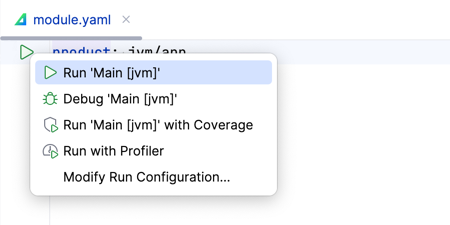
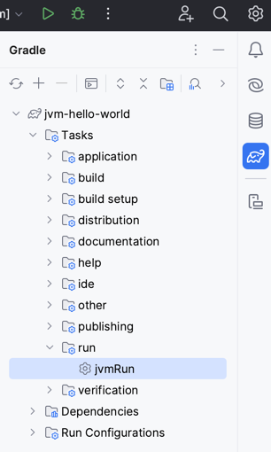

[](https://confluence.jetbrains.com/display/ALL/JetBrains+on+GitHub)
[](https://www.apache.org/licenses/LICENSE-2.0)

# Amper

Amper goal is to improve the project configuration experience, the toolability, that is, the IDE support, and also provide a smooth out-of-the box experience.
We believe that it could be achieved by
- providing a developer- and IDE-friendly declarative configuration DSL - to simplify not only the initial setup, but also improve maintainability and let an IDE assist with automatic configuration reliably;
- bundling a curated set of compatible toolchains and extensions - to support the majority of the scenarios without the need to find compatible plugins;    
- ad carefully choosing the extensibility points - to keep the overall mental model and UX of the configuration consistent and to avoid unexpected third-party code execution.
Basically, we would like to achieve the similar well-though and well-tested experience as with JetBrains IDEs.   

We are looking at various aspects, such as configuring the projects for the purpose of building, packaging, publishing, and more. At its current stage however, the focus is primarily on configuring projects for the purpose of building. 

While the current use case is Kotlin and Kotlin Multiplatform, it also supports Java and Swift (as a requirement for multiplatform). However, the same approach to configuration could work for other languages and technology stacks in the future. 

Amper is implemented as a Gradle plugin and uses YAML for the project configuration format. The goal right now is to validate the user experience, which is why we have chosen to build on top of Gradle, as a well-tested build tool, and provide a configuration layer on top of it.

Supported features:
* Creating and running JVM, Android, iOS, Linux and macOS applications.
* Creating Kotlin Multiplatform libraries.
* Running tests.
* Mixing Kotlin, Java and Swift code.
* Using [Compose Multiplatform](docs/Documentation.md#configuring-compose-multiplatform).
* [Multi-module](docs/Documentation.md#internal-dependencies) projects.
* [Gradle interop](docs/Documentation.md#gradle-interop) (including combining Amper and Gradle modules in one projects).
* Code assistance for [module manifest files](docs/Documentation.md#module-manifest-file-anatomy) in IntelliJ IDEA and Fleet.

Planned features:
* More [product type](docs/Documentation.md#product-types) and platforms, such as watchOS, Windows, etc.
* [Platform-specific test types](docs/Documentation.md#special-types-of-tests), including android instrumented tests.
* [Native dependencies](docs/Documentation.md#native-dependencies) support, such as CocoaPods, Swift Package Manager.
* Integration with [Gradle version catalogs](docs/Documentation.md#dependencyversion-catalogs).
* [Packaging](docs/Documentation.md#packaging) and [publication](docs/Documentation.md#publishing). 
* [Build variants](docs/Documentation.md#build-variants) support.
* [Extensibility](docs/Documentation.md#extensibility).
* Workspaces (organizing multiple modules together).
* Support more Kotlin and Kotlin Multiplatform scenarios and configurations out-of-the-box.


Check the [FAQ for more question](docs/FAQ.md) and the list of [known issues](docs/KnownIssues.md).

Join the [Slack channel](https://kotlinlang.slack.com/archives/C062WG3A7T8) for discussions, submit your ideas in the [tracker](https://youtrack.jetbrains.com/issues/AMPER) and share your feedback [here](https://jebrains.com/amper-feedback).     

For a quick start:
* [Setup instructions](docs/Setup.md)
* [Tutorial](docs/Tutorial.md)  
* [Documentation](docs/Documentation.md) 
* [Example projects](examples)
* Gradle [migration guide](docs/GradleMigration.md)  


## Examples

### Basics
Here is a very basics JVM "Hello, World!" project:
```
|-src
|  |-main.kt
|-test
|  |-MyTest.kt
|-module.yaml
|-...
```

Nothing unexpected in the `main.kt` and `MyTest.kt` files, the interesting part is the `module.yaml`, the Amper manifest file.
In its simplest form it looks like this:
```yaml
# Produce a JVM application 
product: jvm/app
```

That's it. The Kotlin and Java toolchains, test framework and other necessary functionality is configured and available straight out of the box.
You can build it, run it, write test etc.  Check out the [full example](examples/jvm-with-tests).

### Multiplatform

Let's look at a Compose Multiplatform project with Android, iOS and Desktop JVM apps. Here is the project layout:
```
|-ios-app                  # an iOS application
|  |-src
|  |  |-iosApp.swift       # native Swift code
|  |  |-ViewController.kt
|  |  |-...
|  |-module.yaml
|-android-app              # an Android application
|  |-...
|-jvm-app                  # a JVM application
|  |-...
|-shared                   # shared library
|  |-src                   # common code for all platforms
|  |  |-MainScreen.kt
|  |-src@ios               # iOS-specific code
|  |  |-...           
|  |-src@android           # Android-specific code
|  |  |-...
|  |-test                  # common tests
|  |  |-MainScreenTest.kt      
|  |  |-...
|  |-test@ios              # iOS-specicis tests
|  |  |- ...               
|  |-...
|  |-module.yaml
|-... 
```
 
Notice how the `src/` folder contains Kotlin and Swift code together. It could also be Kotlin and Java, or course.   
Another highlight is the shared module with the common code in the `src` folder and the platform-specific code `src@ios` and `src@android` folders.
Read more about the project layout [here](docs/Documentation.md#project-layout).

Here is how `ios-app/module.yaml` manifest file looks like:
```yaml
# Produce an iOS application
product: ios/app

# Depend on the shared library module: 
dependencies:
  - ../shared

settings:
  # Enable Compose Multiplatform framework
  compose: enabled
```

This is pretty straightforward: it defines an iOS application with a dependency on a shared more and enables the Compose Multiplatform framework.
A more interesting example is `shared/module.yaml`:

```yaml
# Produce a shared library for JVM, Android and iOS platforms:
product:
  type: lib
  platforms: [jvm, android, iosArm64, iosSimulatorArm64, iosX64]

# Shared Compose dependencies:
dependencies:
  - $compose.foundation: exported
  - $compose.material3: exported

# Android-only dependencies  
dependencies@android:
  # integration compose with activities
  - androidx.activity:activity-compose:1.7.2: exported
  - androidx.appcompat:appcompat:1.6.1: exported

# iOS-only dependencies with a dependency on a CocoaPod
#   note, that CocoaPods dependencies are not yet implemented in the prototype     
dependencies@ios:
  - pod: 'Alamofire'
    version: '~> 2.0.1'

settings:
  # Enable Kotlin serialization
  kotlin:
    serialization: json
  
  # Enable Compose Multiplatform framework
  compose: enabled
```

A couple of things are worth mentioning. First, the platform-specific `dependencies:` sections with the `@<platform>`-qualifier. [The platform qualifier](docs/Documentation.md#platform-qualifier) can be used both in the manifest and also in the file layout. The qualifier organizes the code, dependencies and settings for a certain platform.  
Second, the `dependencies:` section support not only Kotlin and Maven dependencies, but also [platform-specific package managers](docs/Documentation.md#native-dependencies), such as CocoaPods, Swift Package Manager and others.

These examples show only a limited set of Amper features, of course. Look at the [tutorial](docs/Tutorial.md), [documentation](docs/Documentation.md) and [example projects](examples) to get more insight on the Amper design and its functionality.     

### More examples
Check our more real world examples:
* [JVM "Hello, World!"](examples/jvm-kotlin+java)
* Compose for [iOS](examples/compose-ios), [Android](examples/compose-android) and [desktop](examples/compose-desktop).
* [Multiplatform](examples/multiplatform) project with shared code.
* [Gradle interop](examples/gradle-interop)
* And [others](examples)


### Using Amper in IntelliJ IDEA

See [the setup instructions](docs/Setup.md) to configure your IDE.

Open an Amper project as usual by pointing at the folder with the main `settings.gradle.kts` file:

To run an application:

* use a 'run' () gutter icon next to the `product: ` section in a module.yaml file:\
 


* use a 'run' () gutter icon next to the `main()` function:\
  


* use [Run/Debug configurations](https://www.jetbrains.com/help/idea/run-debug-configuration.html):\
  \
  


* launch a Gradle task directly:\
  
  

To run tests use the same 'run' () gutter icon or Gradle run configuration. Read more on [testing in IntelliJ IDEA](https://www.jetbrains.com/help/idea/work-with-tests-in-gradle.html#run_gradle_test).\


### Using Amper in Fleet

See [the setup instructions](docs/Setup.md) to configure your IDE.

Open an Amper project as usual by pointing at the folder with the main settings.gradle.kts file:

To run an application:

* use a 'run' () gutter icon next to the `product: ` section in a module.yaml file:\
 


* use a 'run' () gutter icon next to the `main()` function:\
  


* use [Run configurations](https://www.jetbrains.com/help/fleet/getting-started-with-kotlin-in-fleet.html#create-rc):\
  \
  


* launch a Gradle task directly:\
  
   
  
  

To run tests use the same 'run' () gutter icon or Gradle run configuration.


