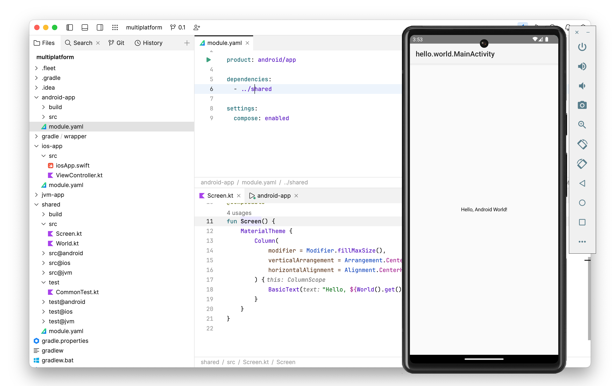

[](https://confluence.jetbrains.com/display/ALL/JetBrains+on+GitHub)
[](https://www.apache.org/licenses/LICENSE-2.0)

# Amper

Amper’s goal is to improve the project configuration experience and toolability, that is, the support inside the IDE, while also providing a smooth out-of-the box experience.
We believe that it could be achieved by
- providing a developer- and IDE-friendly declarative configuration DSL - to simplify not only the initial setup, but also improve maintainability and let an IDE assist with automatic configuration reliably;
- bundling a curated set of compatible toolchains and extensions - to support the majority of the scenarios without the need to find compatible plugins;    
- ad carefully choosing the extensibility points - to keep the overall mental model and UX of the configuration consistent and to avoid unexpected third-party code execution.
Basically, we would like to achieve the similar well-though and well-tested experience as with JetBrains IDEs.   

We’re currently looking at various aspects, including the configuration of projects for the purpose of building, packaging, publishing, and more. At its current stage, however, the focus is primarily on configuring projects for the purpose of building.

While the current use case is Kotlin and Kotlin Multiplatform, it also supports Java and Swift (as a requirement for multiplatform). However, there’s nothing preventing it from working with other languages and technology stacks in the future. 

The current implementation of Amper uses Gradle as the backend and YAML as the frontend (i.e. the project configuration). The goal right now is to validate the user experience (frontend), which is why we are primarily relying on Gradle for the backend. If these are validated, we’ll consider supporting other backends, including one that we’re already working on internally.

Supported features:
* Creating and running JVM, Android, iOS, Linux and macOS applications.
* Creating Kotlin Multiplatform libraries.
* Running tests.
* Mixing Kotlin, Java and Swift code.
* Using [Compose Multiplatform](docs/Documentation.md#configuring-compose-multiplatform).
* [Multi-module](docs/Documentation.md#internal-dependencies) projects.
* [Gradle interop](docs/Documentation.md#gradle-interop) (including combining Amper and Gradle modules in one projects).
* Code assistance for [module manifest files](docs/Documentation.md#module-manifest-file-anatomy) in IntelliJ IDEA and Fleet.

Planned features:
* More [product type](docs/Documentation.md#product-types) and platforms, such as watchOS, Windows, etc.
* [Platform-specific test types](docs/Documentation.md#special-types-of-tests), including android instrumented tests.
* [Native dependencies](docs/Documentation.md#native-dependencies) support, such as CocoaPods, Swift Package Manager.
* Integration with [Gradle version catalogs](docs/Documentation.md#dependencyversion-catalogs).
* [Packaging](docs/Documentation.md#packaging) and [publication](docs/Documentation.md#publishing). 
* [Build variants](docs/Documentation.md#build-variants) support.
* [Extensibility](docs/Documentation.md#extensibility).
* Workspaces (organizing multiple modules together).
* Support more Kotlin and Kotlin Multiplatform scenarios and configurations out-of-the-box.


Check the [FAQ for more question](docs/FAQ.md) and the list of [known issues](docs/KnownIssues.md).

Join the [Slack channel](https://kotlinlang.slack.com/archives/C062WG3A7T8) for discussions, submit your ideas in the [tracker](https://youtrack.jetbrains.com/issues/AMPER) and share your feedback [here](https://jebrains.com/amper-feedback).     

For a quick start:
* [Setup](docs/Setup.md) and [usage](docs/Usage.md) instructions
* [Tutorial](docs/Tutorial.md)  
* [Documentation](docs/Documentation.md) 
* [Example projects](examples)
* Gradle [migration guide](docs/GradleMigration.md)  


## Examples

### Basics
Here is a very basics JVM "Hello, World!" project:


The `main.kt` and `MyTest.kt` files are just regular Kotlin files with nothing special in them. The interesting part is `module.yaml`, which is the Amper manifest file. For the above project structure, it would simply be: 

```yaml
# Produce a JVM application 
product: jvm/app
```

That's it. The Kotlin and Java toolchains, test framework, and other necessary functionality is configured and available straight out of the box. You can build it, run it, write and run tests, and more. For more detailed information, check out the [full example](examples/jvm-with-tests).


### Multiplatform

Now, let's look at a Compose Multiplatform project with Android, iOS, and desktop JVM apps, with the following project structure in Fleet:


Notice how the `src/` folder contains Kotlin and Swift code together. It could, of course, also be Kotlin and Java.
Another aspect to highlight is the shared module with the common code in the `src` folder and the platform-specific code folders `src@ios` and `src@android` (learn more about [project layout](docs/Documentation.md#project-layout)).

Here is how `ios-app/module.yaml` manifest file looks:
```yaml
# Produce an iOS application
product: ios/app

# Depend on the shared library module: 
dependencies:
  - ../shared

settings:
  # Enable Compose Multiplatform framework
  compose: enabled
```

This is pretty straightforward: It defines an iOS application with a dependency on a shared module and enables the Compose Multiplatform framework. A more interesting example would be `shared/module.yaml`:

```yaml
# Produce a shared library for JVM, Android and iOS platforms:
product:
  type: lib
  platforms: [jvm, android, iosArm64, iosSimulatorArm64, iosX64]

# Shared Compose dependencies:
dependencies:
  - $compose.foundation: exported
  - $compose.material3: exported

# Android-only dependencies  
dependencies@android:
  # integration compose with activities
  - androidx.activity:activity-compose:1.7.2: exported
  - androidx.appcompat:appcompat:1.6.1: exported

# iOS-only dependencies with a dependency on a CocoaPod
#   note, that CocoaPods dependencies are not yet implemented in the prototype     
dependencies@ios:
  - pod: 'Alamofire'
    version: '~> 2.0.1'

settings:
  # Enable Kotlin serialization
  kotlin:
    serialization: json
  
  # Enable Compose Multiplatform framework
  compose: enabled
```

A couple of things are worth mentioning. First, note the platform-specific dependencies: sections with the `@<platform>` qualifier. [The platform qualifier](docs/Documentation.md#platform-qualifier) can be used both in the manifest and also in the file layout. The qualifier organizes the code, dependencies, and settings for a certain platform.
Second, the dependencies: section allows not only Kotlin and Maven dependencies, but also [platform-specific package managers](docs/Documentation.md#native-dependencies), such as CocoaPods, Swift Package Manager, and others.



Naturally, these examples show only a limited set of Amper features. Look at the [documentation](docs/Documentation.md), [tutorial](docs/Tutorial.md), and [example projects](examples) to get more insight into Amper’s design and functionality.     

### More examples
Check our more real world examples:
* [JVM "Hello, World!"](examples/jvm-kotlin+java)
* Compose for [iOS](examples/compose-ios), [Android](examples/compose-android) and [desktop](examples/compose-desktop).
* [Multiplatform](examples/multiplatform) project with shared code.
* [Gradle interop](examples/gradle-interop)
* And [others](examples)