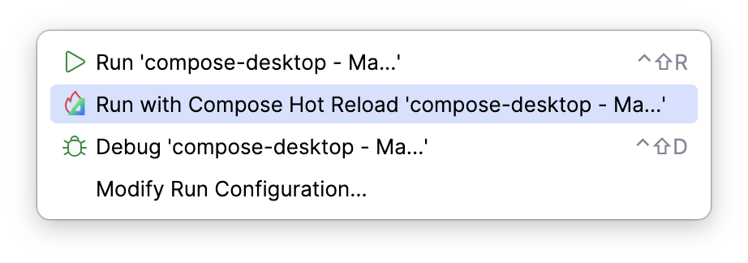

# Amper Documentation

Amper is a build tool for the Kotlin and Java languages.
It can build plain JVM console applications, Android and iOS mobile applications, server-side application like Spring
or Ktor, multiplatform projects that share business logic and/or UI, and more.

## Before you start

Check the [setup instructions](Setup.md).

See the [usage instructions](Usage.md#using-amper-from-the-command-line) to get started with the Amper CLI.

## Basics

An Amper **project** is defined by a `project.yaml` file. This file contains the list of modules and the project-wide
configuration. The folder with the `project.yaml` file is the project root. Modules can only be located anywhere under
the project root. If there is only one module in the project, a `project.yaml` file is not required.

An Amper **module** is a directory with a `module.yaml` configuration file, module sources and resources.
A *module configuration file* describes _what_ to produce: e.g. a reusable library or a platform-specific application.
Each module describes a single product. Several modules can't share same sources or resources, but they can depend on
each other.

> To get familiar with YAML, see [the brief intro](#brief-yaml-reference).

_How_ to produce the desired product, that is, the build rules, is the responsibility of the Amper build engine.

Amper supports Kotlin Multiplatform as a core concept and offers special syntax to deal with multiplatform
configuration. There is a dedicated [**@platform-qualifier**](#platform-qualifier) used to mark platform-specific
dependencies, settings, etc. You'll see it in the examples below.

## Project layout

A basic single-module Amper project looks like this:

```
|-src/             
|  |-main.kt      
|-test/       
|  |-MainTest.kt 
|-module.yaml
```

If there are multiple modules, the `project.yaml` file specifies the list of modules:

```
|-app/
|  |-src/             
|  |  |-main.kt
|  |-...      
|  |-module.yaml
|-lib/
|  |-src/             
|  |  |-util.kt      
|  |-module.yaml
|-project.yaml
```

In the above case, the `project.yaml` looks like this:

```yaml
modules:
  - ./app
  - ./lib
```

Check the [reference](DSLReference.md#modules) for more options to define the list of modules in the `project.yaml` file.


### Source code

Source files are located in the `src` folder:

```
|-src/             
|  |-main.kt      
|-module.yaml
```

By convention, a `main.kt` file, if present, is the default entry point for the application.
Read more on [configuring the application entry points](#configuring-entry-points).

In a JVM module, you can mix Kotlin and Java source files:
```
|-src/             
|  |-main.kt      
|  |-Util.java      
|-module.yaml
```

In a [multiplatform module](#multiplatform-projects), platform-specific code is located in folders
with [`@platform`-qualifiers](#platform-qualifier):
```
|-src/             # common code
|  |-main.kt      
|  |-util.kt       #  API with ‘expect’ part
|-src@ios/         # code to be compiled only for iOS targets
|  |-util.kt       #  API implementation with ‘actual’ part for iOS
|-src@jvm/         # code to be compiled only for JVM targets
|  |-util.kt       #  API implementation with ‘actual’ part for JVM
|-module.yaml
```

Sources and resources can't be shared by multiple modules. This ensures that the IDE always knows how to analyze and
refactor the code, as it always exists in the scope of a single module, has a well-defined list of dependencies, etc.

See also info on [resource management](#resources).


## Module file anatomy

A `module.yaml` file has several main sections: `product:`, `dependencies:` and `settings:`. A module can produce a
single product, such as a reusable library or an application.
Read more on the [supported product types](#product-types).

Here is an example of a JVM console application with a single dependency and a specified Kotlin language version:
```yaml
product: jvm/app

dependencies:
  - io.ktor:ktor-client-core:2.3.0

settings:
  kotlin:
    languageVersion: 1.9
```

Example of a KMP library:
```yaml
product: 
  type: lib
  platforms: [android, iosArm64]

settings:
  kotlin:
    languageVersion: 1.9
```

### Product types

Product type describes the target platform and the type of the project at the same time. Below is the list of supported
product types:

- `lib` - a reusable Amper library which can be used as a dependency by other modules in the Amper project.
- `jvm/app` - a JVM console or desktop application
- `windows/app` - a mingw64 application
- `linux/app` - a native linux application
- `macos/app` - a native macOS application
- `android/app` - an Android VM application  
- `ios/app` - an iOS/iPadOS application

### Multiplatform configuration

`dependencies:` and `setting:` sections can be specialized for each platform using the `@platform`-qualifier.
An example of a multiplatform library with some common and platform-specific code:
```yaml
product:
  type: lib
  platforms: [iosArm64, android]

# These dependencies are available in common code.
# They are also propagated to iOS and Android code, along with their platform-specific counterparts 
dependencies:
  - io.ktor:ktor-client-core:2.3.0

# These dependencies are available in Android code only
dependencies@android:
  - io.ktor:ktor-client-android:2.3.0
  - com.google.android.material:material:1.5.0

# These dependencies are available in iOS code only
dependencies@ios:
  - io.ktor:ktor-client-darwin:2.3.0

# These settings are for common code.
# They are also propagated to iOS and Android code 
settings:
  kotlin:
    languageVersion: 1.8
  android:
    compileSdk: 33

# We can add or override settings for specific platforms. 
# Let's override the Kotlin language version for iOS code: 
settings@ios:
  kotlin:
    languageVersion: 1.9 
```
See [details on multiplatform configuration](#multiplatform-configuration) for more information.

### Dependencies

#### External Maven dependencies

For Maven dependencies, simply specify their coordinates:
```yaml
dependencies:
  - org.jetbrains.kotlin:kotlin-serialization:1.8.0
  - io.ktor:ktor-client-core:2.2.0
```

#### Module dependencies

To depend on another module, use a relative path to the folder which contains the corresponding `module.yaml`.
Module dependency should start either with `./` or `../`.

> Dependencies between modules are only allowed within the project scope.
> That is, they must be listed in the `project.yaml` file.

Example: given the project layout

```
root/
  |-app/
  |  |-src/
  |  |-module.yaml
  |-ui/
  |  |-utils/
  |  |  |-src/
  |  |  |-module.yaml
```

The `app/module.yaml` can declare a dependency on `ui/utils` as follows:

```yaml
dependencies:
  - ../ui/utils
```

Other examples of the internal dependencies:

```yaml
dependencies:
  - ./nested-folder-with-module-yaml
  - ../sibling-folder-with-module-yaml
```

#### Scopes and visibility

There are three dependency scopes:
- `all` - (default) the dependency is available during compilation and runtime.  
- `compile-only` - the dependency is only available during compilation. This is a 'provided' dependency in Maven terminology.
- `runtime-only` - the dependency is not available during compilation, but available during testing and running

In a full form you can declare scope as follows:
```yaml
dependencies:
  - io.ktor:ktor-client-core:2.2.0:
      scope: compile-only 
  - ../ui/utils:
      scope: runtime-only 
```
There is also an inline form: 
```yaml
dependencies:
  - io.ktor:ktor-client-core:2.2.0: compile-only  
  - ../ui/utils: runtime-only
```

All dependencies by default are not accessible from the dependent code.  
In order to make a dependency visible to a dependent module, you need to explicitly mark it as `exported` (this is 
equivalent to declaring a dependency using the `api()` configuration in Gradle). 

```yaml
dependencies:
  - io.ktor:ktor-client-core:2.2.0:
      exported: true 
  - ../ui/utils:
      exported: true 
```
There is also an inline form: 
```yaml
dependencies:
  - io.ktor:ktor-client-core:2.2.0: exported
  - ../ui/utils: exported
```

Here is an example of a `compile-only` and `exported` dependency:
```yaml
dependencies:
  - io.ktor:ktor-client-core:2.2.0:
      scope: compile-only
      exported: true
```

#### External Maven BOM dependencies

For importing BOM (Bill of materials), specify its coordinates prefixed by `bom: `
```yaml
dependencies:
  - bom: io.ktor:ktor-bom:2.2.0
  - io.ktor:ktor-client-core 
```
After BOM is imported, versions of dependencies declared in the module could be omitted,
unspecified versions are resolved from the BOM.
Dependency versions declared in the BOM participate in version conflict resolution.

### Managing Maven repositories

By default, Maven Central and Google Android repositories are pre-configured. To add extra repositories, use the following options: 

```yaml
repositories:
  - https://repo.spring.io/ui/native/release
  - url: https://dl.google.com/dl/android/maven2/
  - id: jitpack
    url: https://jitpack.io
```

To configure repository credentials, use the following snippet:
```yaml
repositories:
  - url: https://my.private.repository/
    credentials:
      file: ../local.properties # relative path to the file with credentials
      usernameKey: my.private.repository.username
      passwordKey: my.private.repository.password
```

Here is the file `../local.properties`:
```properties
my.private.repository.username=...
my.private.repository.password=...
```

> Currently only `*.properties` files with credentials are supported.


### Library Catalogs (a.k.a Version Catalogs)

A library catalog associates keys to library coordinates (including the version), and allows adding the same libraries
as dependencies to multiple modules without having to repeat the coordinates or the versions of the libraries.

Amper currently supports 2 types of dependency catalogs:
- toolchain catalogs (such as Kotlin, Compose Multiplatform etc.)
- Gradle version catalogs that are placed in the default [gradle/libs.versions.toml file](https://docs.gradle.org/current/userguide/version_catalogs.html#sec:version-catalog-declaration)

The toolchain catalogs are implicitly defined, and contain predefined libraries that relate to the corresponding toolchain.
The name of such a catalog corresponds to the [name of the corresponding toolchain in the settings section](#settings).
For example, dependencies for the Compose Multiplatform frameworks are accessible using the `$compose` catalog.
All dependencies in such catalogs usually have the same version, which is the toolchain version.

The Gradle version catalogs are user-defined catalogs using the Gradle format.
Dependencies from this catalog can be accessed via the `$libs` catalog, and the library keys are defined according
to the [Gradle name mapping rules](https://docs.gradle.org/current/userguide/version_catalogs.html#sec:mapping-aliases-to-accessors).

To use dependencies from catalogs, use the syntax `$<catalog-name>.<key>` instead of the coordinates, for example:
```yaml
dependencies:
  - $kotlin.reflect      # dependency from the Kotlin catalog
  - $compose.material3   # dependency from the Compose Multiplatform catalog
  - $libs.commons.lang3  # dependency from the Gradle default libs.versions.toml catalog
```

Module dependencies can still have a [scope and visibility](#scopes-and-visibility) even when coming from a catalog:

```yaml
dependencies:
  - $compose.foundation: exported
  - $my-catalog.db-engine: runtime-only 
```

### Settings

The `settings:` section contains toolchains settings.
A _toolchain_ is an SDK (Kotlin, Java, Android, iOS) or a simpler tool (linter, code generator).

> Toolchains are supposed to be extensible in the future.

All toolchain settings are specified in the dedicated groups in the `settings:` section:
```yaml
settings:
  kotlin:
    languageVersion: 1.8
  android:
    compileSdk: 31
```

Here is the list of [currently supported toolchains and their settings](DSLReference.md#settings-and-test-settings).   

See [multiplatform settings configuration](#multiplatform-settings) for more details.

#### Configuring Kotlin Serialization

[Kotlin Serialization](https://github.com/Kotlin/kotlinx.serialization) is the official multiplatform and multi-format
serialization library for Kotlin.

If you need to (de)serialize Kotlin classes to/from JSON, you can enable Kotlin Serialization it in its simplest form:
```yaml
settings:
  kotlin:
    serialization: json  # JSON or other format
```
This snippet configures the compiler to process `@Serializable` classes, and adds dependencies on the serialization
runtime and JSON format libraries.

You can also customize the version of the Kotlin Serialization libraries using the full form of the configuration:

```yaml
settings:
  kotlin:
    serialization:
      format: json
      version: 1.7.3
```

##### More control over serialization formats

If you don't need serialization format dependencies or if you need more control over them, you can use the following:
```yaml
settings:
  kotlin:
    serialization: enabled # configures the compiler and serialization runtime library
```
This snippet on its own only configures the compiler and the serialization runtime library, but doesn't add any format
dependency. However, it adds a built-in catalog with official serialization formats libraries, which you can use in 
your `dependencies` section. This is useful in multiple cases:

* if you need a format dependency only in tests:
  ```yaml
  settings:
    kotlin:
      serialization: enabled
  
  test-dependencies:
    - $kotlin.serialization.json
  ```

* if you need to customize the scope of the format dependencies:
  ```yaml
  settings:
    kotlin:
      serialization: enabled
  
  dependencies:
    - $kotlin.serialization.json: compile-only
  ```

* if you need to expose format dependencies transitively:
  ```yaml
  settings:
    kotlin:
      serialization: enabled
  
  dependencies:
    - $kotlin.serialization.json: exported
  ```

* if you need multiple formats:
  ```yaml
  settings:
    kotlin:
      serialization: enabled
  
  dependencies:
    - $kotlin.serialization.json
    - $kotlin.serialization.protobuf
  ```

#### Configuring Compose Multiplatform

In order to enable [Compose](https://www.jetbrains.com/lp/compose-multiplatform/) (with a compiler plugin and required dependencies), add the following configuration:

JVM Desktop:
```yaml
product: jvm/app

dependencies:
  # add Compose dependencies using a dependency catalog:
  - $compose.desktop.currentOs
    
settings: 
  # enable Compose toolchain
  compose: enabled
```

Android:
```yaml
product: android/app

dependencies:
  # add Compose dependencies using a dependency catalog:
  - $compose.foundation
  - $compose.material3

settings: 
  # enable Compose toolchain
  compose: enabled
```

There is also a full form for enabling or disabling the Compose toolchain:
```yaml
...
settings: 
  compose:
    enabled: true
```

Also, you can specify the exact version of the Compose framework to use:

```yaml
...
settings:
  compose:
    version: 1.5.10
```

##### Using multiplatform resources

Amper supports [Compose Multiplatform resources](https://www.jetbrains.com/help/kotlin-multiplatform-dev/compose-images-resources.html).

The file layout for the standalone Amper is:
```
|-my-kmp-module/
|  |-module.yaml
|  |-src/ # your code is here
|  |  |-...
|  |-composeResources/ # place your multiplatform resources in this folder
|  |  |-values/
|  |  |  |-strings.xml
|  |  |-drawable/
|  |  |  |-image.jpg
|  |-...
```

Amper automatically generates the accessors for resources during the build and when working with code in the IDE.
Accessors are generated in a package that corresponds to the module name. All non-letter symbols are replaced with `_`.
In the given example where the module name is `my-kmp-module`, the package name for the generated resources 
will be `my_kmp_module`.

Here is how to use the resources in the code:

```kotlin
import my_kmp_module.generated.resources.Res
import my_kmp_module.generated.resources.hello
// other imports

@Composable
private fun displayHelloText() {
    BasicText(stringResource(Res.string.hello))
}
```

Read more about setting up and using compose resources in [the documentation](https://www.jetbrains.com/help/kotlin-multiplatform-dev/compose-images-resources.html).

#### Configuring entry points

##### JVM
By default, the entrypoint of JVM applications (the `main` function) is expected to be in a `main.kt` file 
(case-insensitive) in the `src` folder.

This can be overridden by specifying a main class explicitly in the module settings:
```yaml
product: jvm/app

settings:
  jvm:
    mainClass: org.example.myapp.MyMainKt
```

> [!NOTE]
> In Kotlin, unlike Java, the `main` function doesn't have to be declared in a class, and is usually at the top level
> of the file. However, the JVM still expects a main class when running any application. Kotlin always compiles 
> top-level declarations to a class, and the name of that class is derived from the name of the file by capitalizing 
> the name and turning the `.kt` extension into a `Kt` suffix.
> 
> For example, the top-level declarations of `myMain.kt` will be in a class named `MyMainKt`.

##### Native

By default, the entrypoint of Kotlin native applications (the `main` function) is expected to be in a `main.kt` file 
(case-insensitive) in the `src` folder.

This can be overridden by specifying the fully qualified name of the `main` function explicitly in the module settings:
```yaml
product: jvm/app

settings:
  native:
    entryPoint: org.example.myapp.main
```

##### Android

Android apps have their own way to configure the entry point, see the [dedicated Android section](#entry-point).

##### iOS

For iOS applications, the entrypoint is expected to be a `@main` struct in any Swift file in the `src` folder.
```
|-src/ 
|  |-main.swift
|  |-... 
|-module.yaml
|-module.xcodeproj
```

src/main.swift:
```swift
...
@main
struct iosApp: App {
   ...
}
```

This is not customizable at the moment.

#### Configuring Android

Use the `android/app` product type in a module to build an Android application.

##### Entry point

The application's entry point is specified in the AndroidManifest.xml file according to the 
[official Android documentation](https://developer.android.com/guide/topics/manifest/manifest-intro).
```
|-src/ 
|  |-MyActivity.kt
|  |-AndroidManifest.xml
|  |-... 
|-module.yaml
```

`src/AndroidManifest.xml`:
```xml
<manifest ... >
  <application ... >
    <activity android:name="com.example.myapp.MainActivity" ... >
    </activity>
  </application>
</manifest>
```

You can run your application using the `run` command.

##### Packaging

You can use the `build` command to create an APK, or the `package` command to create an Android Application Bundle (AAB).

The `package` command will not only build the APK, but also minify/obfuscate it with ProGuard, and sign it.
See the dedicated [signing](#signing) and [code shrinking](#code-shrinking) sections to learn how to configure this. 

#### Code shrinking

When creating a release build with Amper, R8 will be used automatically, with minification and shrinking enabled.
This is equivalent to the following Gradle configuration:

```kotlin
// in Gradle
isMinifyEnabled = true
isShrinkResources = true
proguardFiles(getDefaultProguardFile("proguard-android-optimize.txt"))
```

You can create a `proguard-rules.pro` file in the module folder to add custom rules for R8.

```
|-src/
|  ...      
|-test/
|  ...
|-proguard-rules.pro
|-module.yaml
```

It is automatically used by Amper if present.

An example of how to add custom R8 rules can be found [in the android-app module](../examples-standalone/compose-multiplatform/android-app/proguard-rules.pro) of the `compose-multiplatform` example project.

##### Signing

In a module containing an Android application (using the `android/app` product type) you can enable signing under
settings:

```yaml
settings:
  android:
    signing: enabled
```

This will use a `keystore.properties` file located in the module folder for the signing details by default. This
properties file must contain the following signing details. **Remember that these details should usually not be added
to version control.**

```properties
storeFile=/Users/example/.keystores/release.keystore
storePassword=store_password
keyAlias=alias
keyPassword=key_password
```

To customize the path to this file, you can use the `propertiesFile` option:

```yaml
settings:
  android:
    signing:
      enabled: true
      propertiesFile: ./keystore.properties # default value
```

With the standalone version of Amper, you can use `./amper tool generate-keystore` to generate a new keystore if you
don't have one yet. This will create a new self-signed certificate, using the details in the `keystore.properties` file.

> You can also pass in these details to `generate-keystore` as command line arguments. Invoke the tool with `--help`
> to learn more.

##### Parcelize

If you want to automatically generate your `Parcelable` implementations, you can enable 
[Parcelize](https://developer.android.com/kotlin/parcelize) as follows:

```yaml
settings:
  android:
    parcelize: enabled
```

With this simple toggle, the following class gets its `Parcelable` implementation automatically without spelling it out
in the code, just thanks to the `@Parcelize` annotation:
```kotlin
import kotlinx.parcelize.Parcelize

@Parcelize
class User(val firstName: String, val lastName: String, val age: Int): Parcelable
```

While this is only relevant on Android, sometimes you need to share your data model between multiple platforms.
However, the `Parcelable` interface and `@Parcelize` annotation are only present on Android.
But fear not, there is a solution described in the
[official documentation](https://developer.android.com/kotlin/parcelize#setup_parcelize_for_kotlin_multiplatform).
In short:

* For `android.os.Parcelable`, you can use the `expect`/`actual` mechanism to define your own interface as typealias of 
`android.os.Parcelable` (for Android), and as an empty interface for other platforms.
* For `@Parcelize`, you can simply define your own annotation instead, and then tell Parcelize about it (see below).

For example, in common code:
```kotlin
@Target(AnnotationTarget.CLASS)
@Retention(AnnotationRetention.BINARY)
annotation class MyParcelize

expect interface MyParcelable
```
Then in Android code:
```kotlin
actual typealias MyParcelable = android.os.Parcelable
```
And in other platforms:
```kotlin
// empty because nothing is generated on non-Android platforms
actual interface MyParcelable
```

You can then make Parcelize recognize this custom annotation using the `additionalAnnotations` option:

```yaml
settings:
  kotlin:
    # for the expect/actual MyParcelable interface
    freeCompilerArgs: [ -Xexpect-actual-classes ]
  android:
    parcelize:
      enabled: true
      additionalAnnotations: [ com.example.MyParcelize ]
```


#### Google Services and Firebase

To enable the [`google-services` plugin](https://developers.google.com/android/guides/google-services-plugin), place 
your `google-services.json` file in the module containing an `android/app` product, next to `module.yaml`.
    
```
|-androidApp/
|  |-src/
|  |-google-services.json
|  |-module.yaml
```
 
This file will be found and consumed automatically.

#### Configuring Kotlin Symbol Processing (KSP)

[Kotlin Symbol Processing](https://kotlinlang.org/docs/ksp-overview.html) is a tool that allows feeding Kotlin source
code to _processors_, which can in turn use this information to generate code, classes, or resources, for instance.
Amper provides built-in support for KSP.

Some popular libraries also include a KSP processor to enhance their capabilities, such as
[Room](https://developer.android.com/jetpack/androidx/releases/room) or
[Moshi](https://github.com/square/moshi#codegen).

> Note: Amper works with KSP2, so any processors used must be compatible with KSP2.
> We’re expecting most processors to make this upgrade soon, as KSP1 is deprecated and will not support Kotlin 2.1.
> However, at the moment, you might still see some gaps in support, such as issues with native targets.

To add KSP processors to your module, add their maven coordinates to the `settings.kotlin.ksp.processors` list:

```yaml
settings:
  kotlin:
    ksp:
      processors:
        - androidx.room:room-compiler:2.7.0-alpha12
```

In multiplatform modules, all settings from the `settings` section apply to all platforms by default, including KSP processors.
If you only want to add KSP processors for a specific platform, use a `settings` block with a
[platform qualifier](#platform-qualifier):

```yaml
# the Room processor will only process code that compiles to the Android platform
settings@android:
  kotlin:
    ksp:
      processors:
        - androidx.room:room-compiler:2.7.0-alpha12
```

Some processors can be customized by passing options. You can pass these options using the `processorOptions` section:

```yaml
settings:
  kotlin:
    ksp:
      processors:
        - androidx.room:room-compiler:2.7.0-alpha12
      processorOptions:
        room.schemaLocation: ./schema
```

> Note: all options are passed to all processors by KSP. It's the processor's responsibility to use unique option names
> to avoid clashes with other processor options.

##### Using your own local KSP processor

You can implement your own processor in an Amper module as a regular JVM library, and then use it to process code from
other modules in your project.

Usually, 3 modules are involved:
* The _processor_ module, with the actual processor implementation
* The _annotations_ module (optional), which contains annotations that the processor looks for in the consumer code
* The _consumer_ module, which uses KSP with the custom processor

The annotations module is a very simple JVM library module without any required dependencies (it's just here to provide
some annotations to work with, if necessary):
```yaml
# my-processor-annotations/module.yaml
product:
  type: lib
  platforms: [ jvm ]
```

The processor module is a JVM library with a `compile-only` dependency on KSP facilities, and on the custom annotations module:
```yaml
# my-processor/module.yaml
product:
  type: lib
  platforms: [ jvm ]

dependencies:
  - ../my-processor-annotations
  - com.google.devtools.ksp:symbol-processing-api:2.0.21-1.0.25: compile-only
```

The consumer module adds a regular dependency on the annotations module, and a reference to the processor module: 
```yaml
# my-consumer/module.yaml
product: jvm/app

dependencies:
  - ../my-processor-annotations # to be able to annotate the consumer code

settings:
  kotlin:
    ksp:
      processors:
        - ../my-processor # path to the module implementing the KSP processor
```

For more information about how to write your own processor, check out
[the KSP documentation](https://kotlinlang.org/docs/ksp-quickstart.html#create-a-processor-of-your-own).

#### Configuring all-open compiler plugin

To enable [all-open](https://kotlinlang.org/docs/all-open-plugin.html), add the following configuration:

```yaml

  settings:
    kotlin:
      allOpen:
        enabled: true
        annotations: 
          - org.springframework.context.annotation.Configuration
          - org.springframework.stereotype.Service
          - org.springframework.stereotype.Component
          - org.springframework.stereotype.Controller
          - ...

```

Or you can use one of the preconfigured presets that contain all-open annotations related to specific frameworks:

```yaml
  settings:
    kotlin:
      allOpen:
        enabled: true
        presets:
          - spring
          - micronaut
```


#### Configuring no-arg compiler plugin

To enable [no-arg](https://kotlinlang.org/docs/no-arg-plugin.html), add the following configuration:

```yaml
  settings:
    kotlin:
      noArg:
        enabled: true
        annotations: 
          - jakarta.persistence.Entity
          - ...
```

Or you can use one of the preconfigured presets that contain no-arg annotations related to specific frameworks:

```yaml
  settings:
    kotlin:
      noArg:
        enabled: true
        presets: 
          - jpa
```

#### Java annotation processing

To add java annotation processors to your module, add their maven coordinates to the 
`settings.java.annotationProcessing.processors` list:  

```yaml
settings:
  java:
    annotationProcessing:
      processors:
        - org.mapstruct:mapstruct-processor:1.6.3
```

This option is only available for java or android modules (it's a platform-specific).

As with KSP, it's possible to reference a local Amper module as a processor. See the 
[KSP section](#using-your-own-local-ksp-processor) for more information. Using library catalog entry is also supported.

Some annotation processors can be customized by passing options.
You can pass these options using the `processorOptions` map:

```yaml
settings:
  java:
    annotationProcessing:
      processors:
        - $libs.auto.service # using catalog reference 
      processorOptions:
        debug: true
```

#### Configuring Lombok

Despite there is a way to configure annotation processing in general for Java, for the Kotlin interop you need a 
compiler plugin configured. So if you want to add Lombok to your project it is better to use `settings:lombok` instead 
of configuring `settings:java:annotationProcessing` directly even if your module is java-only. Enabling Lombok is by

```yaml

  settings:
    lombok: enabled
```

adds `lombok` dependency, annotation processor and kotlin compiler plugin.

### Tests

Test code is located in the `test/` folder:
```
|-src/            # production code
|  ...      
|-test/           # test code 
|  |-MainTest.kt
|  |-... 
|-module.yaml
```

By default, the [Kotlin test](https://kotlinlang.org/api/latest/kotlin.test/) framework is preconfigured for each
platform. Additional test-only dependencies should be added to the `test-dependencies:` section of your module
configuration file:

```yaml
product: jvm/app

# these dependencies are available in main and test code
dependencies:
  - io.ktor:ktor-client-core:2.2.0

# additional dependencies for test code
test-dependencies:
  - io.ktor:ktor-server-test-host:2.2.0
```

To add or override [toolchain settings](#settings) in tests, use `test-settings:` section:
```yaml
# these dependencies are available in main and test code
setting:
  kotlin:
    ...

# additional test-specific setting 
test-settings:
  kotlin:
    ...
```

Test settings and dependencies by default are inherited from the main configuration according to the [configuration propagation rules](#dependencysettings-propagation). 
Example:
```
|-src/             
|  ...      
|-src@ios/             
|  ...      
|-test/           # Sees declarations from src/. Executed on all platforms. 
|  |-MainTest.kt
|  |-... 
|-test@ios/       # Sees declarations from src/, src@ios/, and `test/`. Executed on iOS platforms only.  
|  |-IOSTest.kt 
|  |-... 
|-module.yaml
```

```yaml
product:
  type: lib
  platforms: [android, iosArm64]

# these dependencies are available in main and test code
dependencies:
  - io.ktor:ktor-client-core:2.2.0

# dependencies for test code
test-dependencies:
  - org.jetbrains.kotlin:kotlin-test:1.8.10
  
# these settings affect the main and test code
settings: 
  kotlin:
    languageVersion: 1.8

# these settings affect tests only
test-settings:
  kotlin:
    languageVersion: 1.9 # overrides `settings:kotlin:languageVersion: 1.8`
```

## Resources

Files placed into the `resources` folder are copied to the resulting products:
```
|-src/             
|  |-...
|-resources/     # These files are copied into the final products
|  |-...
```

In [multiplatform modules](#multiplatform-configuration) resources are merged from the common folders and corresponding platform-specific folders:
```
|-src/             
|  |-...
|-resources/          # these resources are copied into the Android and JVM artifact
|  |-...
|-resources@android/  # these resources are copied into the Android artifact
|  |-...
|-resources@jvm/      # these resources are copied into the JVM artifact
|  |-...
```

In case of duplicating names, the common resources are overwritten by the more specific ones. 
That is `resources/foo.txt` will be overwritten by `resources@android/foo.txt`.  

Android modules also have [res and assets](https://developer.android.com/guide/topics/resources/providing-resources) folders:
```
|-src/             
|  |-...
|-res/
|  |-drawable/
|  |  |-...
|  |-layout/
|  |  |-...
|  |-...
|-assets/
|  |-...
|-module.yaml
```

## Interoperability between languages

Kotlin Multiplatform implies smooth interoperability with platform languages, APIs, and frameworks.
There are three distinct scenarios where such interoperability is needed:

- Consuming: Kotlin code can use APIs from existing platform libraries, e.g. jars on JVM (later CocoaPods on iOS too).  
- Publishing: Kotlin code can be compiled and published as platform libraries to be consumed by the target platform's 
  tooling; such as jars on JVM, frameworks on iOS (maybe later .so on linux).    
- Joint compilation: Kotlin code be compiled and linked into a final product together with the platform languages, like
  JVM, Objective-C, and Swift.

Joint compilation is already supported for Java and Kotlin, with 2-way interoperability: Java code can reference Kotlin
declarations, and vice versa. 
So Java code can be placed alongside Kotlin code in the same source folder that is compiled for JVM/Android:

```
|-src/             
|  |-main.kt      
|-src@jvm/             
|  |-KotlinCode.kt      
|  |-JavaCode.java      
|-src@android/             
|  |-KotlinCode.kt 
|  |-JavaCode.java
|-src@ios/
|  |- ...
|-module.yaml
```

In the future, Kotlin Native will also support joint Kotlin+Swift compilation in the same way,
but this is not the case yet. 
At the moment, Kotlin code is first compiled into a single framework per `ios/app` module, 
and then Swift is compiled using the Xcode toolchain with a dependency on that framework. 
This means that Swift code can reference Kotlin declarations, but Kotlin cannot reference Swift declarations. 
See more at the dedicated [Swift support](#swift-support) section.

## Multiplatform projects

### Platform qualifier

Use the `@platform`-qualifier to mark platform-specific source folders and sections in the `module.yaml` files. 
You can use Kotlin Multiplatform [platform names](https://kotlinlang.org/docs/native-target-support.html) and families as `@platform`-qualifier.
```yaml
dependencies:               # common dependencies for all platforms
dependencies@ios:           # ios is a platform family name  
dependencies@iosArm64:      # iosArm64 is a KMP platform name
```
```yaml
settings:                   # common settings for all platforms
settings@ios:               # ios is a platform family name  
settings@iosArm64:          # iosArm64 is a KMP platform name
```
```
|-src/                      # common code for all platforms
|-src@ios/                  # sees declarations from src/ 
|-src@iosArm64/             # sees declarations from src/ and from src@ios/ 
```

See also how the [resources](#resources) are handled in the multiplatform projects.  


Only the platform names (but not the platform family names) can be currently used in the `platforms:` list:

```yaml
product:
  type: lib
  platforms: [iosArm64, android, jvm]
```

### Platforms hierarchy

Some target platforms belong to the same family and share some common APIs.
They form a hierarchy as follows:
```yaml
common  # corresponds to src directories or configuration sections without @platform suffix
  jvm
  android  
  native
    linux
      linuxX64
      linuxArm64
    mingw
      mingwX64
    apple
      macos
        macosX64
        macosArm64
      ios
        iosArm64
        iosSimulatorArm64
        iosX64            # iOS Simulator for Intel Mac
      watchos
        watchosArm32
        watchosArm64
        watchosDeviceArm64
        watchosSimulatorArm64
        watchosX64
      tvos
        tvosArm64
        tvosSimulatorArm64
        tvosX64
  ...
```

> Note: not all platforms listed here are equally supported or tested.
> Additional platforms may also exist in addition to the ones listed here, but are also untested/highly experimental. 

Based on this hierarchy, common code is visible from more `@platform`-specific code, but not vice versa:
```
|-src/             
|  |-...      
|-src@ios/                  # sees declarations from src/ 
|  |-...      
|-src@iosArm64/             # sees declarations from src/ and from src@ios/ 
|  |-...      
|-src@iosSimulatorArm64/    # sees declarations from src/ and from src@ios/ 
|  |-...      
|-src@jvm/                  # sees declarations from src/
|  |-...      
|-module.yaml
```

You can therefore share code between platforms by placing it in a common ancestor in the hierarchy:
code placed in `src@ios` is shared between `iosArm64` and `iosSimulatorArm64`, for instance.

For [Kotlin Multiplatform expect/actual declarations](https://kotlinlang.org/docs/multiplatform-connect-to-apis.html), put your `expected` declarations into the `src/` folder, and `actual` declarations into the corresponding `src@<platform>/` folders. 

This hierarchy applies to `@platform`-qualified sections in the configuration files as well.
We'll see how this works more precisely in the [Multiplatform Dependencies](#multiplatform-dependencies) and
[Multiplatform Settings](#multiplatform-settings) sections.

#### Aliases

If the default hierarchy is not enough, you can create custom `aliases`, each corresponding to a group of target platforms.
You can then use the alias in places where `@platform` suffixes usually appear to share code or configuration:

```yaml
product:
  type: lib
  platforms: [iosArm64, android, jvm]

aliases:
  - jvmAndAndroid: [jvm, android] # defines a custom alias for this group of platforms

# these dependencies will be visible in jvm and android code
dependencies@jvmAndAndroid:
  - org.lighthousegames:logging:1.3.0

# these dependencies will be visible in jvm code only
dependencies@jvm:
  - org.lighthousegames:logging:1.3.0
```

```
|-src/             
|-src@jvmAndAndroid/ # sees declarations from src/ 
|-src@jvm/           # sees declarations from src/ and src@jvmAndAndroid/              
|-src@android/       # sees declarations from src/ and src@jvmAndAndroid/             
```

### Multiplatform dependencies

When you use a Kotlin Multiplatform library, its platforms-specific parts are automatically configured for each module platform.

Example:
To add a [KmLogging library](https://github.com/LighthouseGames/KmLogging) to a multiplatform module, simply write

```yaml
product:
  type: lib
  platforms: [android, iosArm64, jvm]

dependencies:
  - org.lighthousegames:logging:1.3.0
```
The effective dependency lists are:
```yaml
dependencies@android:
  - org.lighthousegames:logging:1.3.0
  - org.lighthousegames:logging-android:1.3.0
```
```yaml
dependencies@iosArm64:
  - org.lighthousegames:logging:1.3.0
  - org.lighthousegames:logging-iosarm64:1.3.0
```
```yaml
dependencies@jvm:
  - org.lighthousegames:logging:1.3.0
  - org.lighthousegames:logging-jvm:1.3.0
```

For the explicitly specified dependencies in the `@platform`-sections the general [propagation rules](#dependencysettings-propagation) apply. That is, for the given configuration:
```yaml
product:
  type: lib
  platforms: [android, iosArm64, iosSimulatorArm64]
  
dependencies:
  - ../foo
dependencies@ios:
  - ../bar
dependencies@iosArm64:
  - ../baz
```
The effective dependency lists are:
```yaml
dependencies@android:
  ../foo
```
```yaml
dependencies@iosSimulatorArm64:
  ../foo
  ../bar
```
```yaml
dependencies@iosArm64:
  ../foo
  ../bar
  ../baz
```
### Multiplatform settings

All toolchain settings, even platform-specific can be placed in the `settings:` section:
```yaml
product:
  type: lib
  platforms: [android, iosArm64]

settings:
  # Kotlin toolchain settings that are used for both platforms
  kotlin:
    languageVersion: 1.8

  # Android-specific settings are used only when building for android
  android:
    compileSdk: 33
```

There are situations when you need to override certain settings for a specific platform only.
You can use `@platform`-qualifier. 

Note that certain platform names match the toolchain names, e.g. Android:
- `settings@android` qualifier specifies settings for all Android target platforms
- `settings:android:` is an Android toolchain settings   

This could lead to confusion in cases like:
```yaml
product: android/app

settings@android:    # settings to be used for Android target platform
  android:           # Android toolchain settings
    compileSdk: 33
  kotlin:        # Kotlin toolchain settings
    languageVersion: 1.8
```
Luckily, there should rarely be a need for such a configuration.
We also plan to address this by linting with conversion to a more readable form:   
```yaml
product: android/app

settings:
  android:           # Android toolchain settings
    compileSdk: 33
  kotlin:        # Kotlin toolchain settings
    languageVersion: 1.8
```

For settings with the `@platform`-qualifiers, the [propagation rules](#dependencysettings-propagation) apply.
E.g., for the given configuration:
```yaml
product:
  type: lib
  platforms: [android, iosArm64, iosSimulatorArm64]

settings:           # common toolchain settings
  kotlin:           # Kotlin toolchain
    languageVersion: 1.8
    freeCompilerArgs: [x]
  android:              # Android toolchain
    compileSdk: 33

settings@android:   # specialization for Android platform
  compose: enabled  # Compose toolchain

settings@ios:       # specialization for all iOS platforms
  kotlin:           # Kotlin toolchain
    languageVersion: 1.9
    freeCompilerArgs: [y]

settings@iosArm64:  # specialization for iOS arm64 platform 
  ios:              # iOS toolchain
    freeCompilerArgs: [z]
```
The effective settings are:
```yaml 
settings@android:
  kotlin:
    languageVersion: 1.8   # from settings:
    freeCompilerArgs: [x]  # from settings:
  compose: enabled         # from settings@android:
  android:                
    compileSdk: 33         # from settings@android:
```
```yaml 
settings@iosArm64:
  kotlin:
    languageVersion: 1.9      # from settings@ios:
    freeCompilerArgs: [x, y]  # merged from settings: and settings@ios:
```
```yaml 
settings@iosSimulatorArm64:
  kotlin:
    languageVersion: 1.9      # from settings@ios:
    freeCompilerArgs: [x, y, z]  # merged from settings: and settings@ios: and settings@iosArm64:
```

### Dependency/Settings propagation

Common `dependencies:` and `settings:` are automatically propagated to the platform families and platforms in `@platform`-sections, using the following rules:
- Scalar values (strings, numbers etc.) are overridden by more specialized `@platform`-sections.
- Mappings and lists are appended.

Think of the rules like adding merging Java/Kotlin Maps.

## Serverside

For serverside development Amper natively supports Spring Boot and Ktor server.

### Spring boot

To enable Spring boot support, add the following to the `module.yaml` file:

```yaml

settings:
  springBoot: enabled
```

Setting `springBoot: enabled` performs the following actions:
*   Applies Spring Dependencies BOM
*   Adds `spring-boot-starter` dependency
*   Adds `spring-boot-starter-test` test dependency
*   Configures `all-open` and `no-arg` Kotlin compiler plugins
*   Adds the necessary compiler arguments for `kotlinc` and `javac`
*   Contributes Spring Boot-related entries to the built-in library catalog

Mixed projects (containing java and kotlin sources simultaneously) are supported.

Examples of Spring Boot projects:
* [spring-petclinic](../examples-standalone/spring-petclinic)
* [spring-petclinic-kotlin](../examples-standalone/spring-petclinic-kotlin)

### Ktor

To enable Ktor support, add the following to the `module.yaml` file:

```yaml

settings:
  ktor: enabled
```

Setting `ktor: enabled` performs the following actions:
*   Applies Ktor BOM
*   Contributes Ktor-related entries to a built-in library catalog
*   Adds default jvmArgs when running the app

Examples of Ktor projects:
* [ktor-simplest-sample](../examples-standalone/ktor-simplest-sample)

## iOS support

### Xcode Project

Currently, an Xcode project is required to build an iOS application in Amper.
It has to be named `module.xcodeproj` and located in the module root directory of the `ios/app` module.

Normally, when the Amper project is created via `amper init` or via the IDE's Wizard, the appropriate Xcode project is
already there. This is currently the recommended way of creating projects that have an iOS app module.

However, if the Amper project is created from scratch, the default buildable Xcode project will be created automatically
after the first project build.
This project can later be customized and checked into a VCS.

If you want to migrate an existing Xcode project so it has Amper support, you must manually ensure that:
1. it is named `module.xcodeproj` and is located in the root of the `ios/app` module
2. it has a single iOS application target
3. the target has `Debug` & `Release` build configurations, each containing `AMPER_WRAPPER_PATH = <relative path to amper wrapper script>`. 
The path is relative to the Amper module root.
4. the target has a script build phase called `Build Kotlin with Amper` with the code:
   ```bash
    # !AMPER KMP INTEGRATION STEP!
    # This script is managed by Amper, do not edit manually!
    "${AMPER_WRAPPER_PATH}" tool xcode-integration
   ```
5. The _Framework Search Paths_ (`FRAMEWORK_SEARCH_PATHS`) option contains the `$(TARGET_BUILD_DIR)/AmperFrameworks` value

Changes to the Xcode project that do not break these requirements are allowed.

So the iOS app module layout looks like this:
```
|-src/             
|  |-KotlinCode.kt      # optional, if all the code is in the libraries
|  |-EntryPoint.swift
|  |-Info.plist
|-module.yaml           # ios/app
|-module.xcodeproj      # xcode project
```

> [!NOTE]
> The Xcode project can be built normally from the Xcode IDE, if needed.

### Swift support

> [!IMPORTANT]
> Swift sources are only fully supported in the `src` directory of the `ios/app` module.

While swift sources are, strictly speaking, managed by the Xcode project and, as such,
can reside in arbitrary locations, it's not recommended to have them anywhere outside the `src` directory - the tooling
might not work correctly.

To use Kotlin code from Swift, one must import the `KotlinModules` framework.
This framework is built from:
1. the code inside the `ios/app` module itself 
2. the modules that `ios/app` module depends on (e.g. `- ../shared`)
3. all the external dependencies, transitively

> [!NOTE]
> All declarations from the source Kotlin code are accessible to Swift, while external dependencies are not.

## Compose Hot Reload (experimental)

Amper supports [Compose Hot Reload](https://github.com/JetBrains/compose-hot-reload), allowing you to see UI changes in
real-time without restarting the application. This significantly improves the developer experience by shortening the
feedback loop during UI development.

### Configuration

To enable Compose Hot Reload, use a `jvm/app` module, and set `compose.experimental.hotReload` to `enabled`:

```yaml
product: jvm/app

settings:
  compose:
    enabled: true
    experimental:
      hotReload: enabled
```

When you run your application with Compose Hot Reload enabled:

- Amper automatically downloads and runs [JetBrains Runtime](https://github.com/JetBrains/JetBrainsRuntime) to maximize
  hot-swap capabilities
- A Java agent for Compose Hot Reload is attached during execution
- A small Compose Hot Reload devtools icon appears next to the application window, indicating that the feature is active


### IDE Integration

When running your app from the IDE, you can get automatic recompilation and reloading based on file system changes,
using the [Amper IntelliJ plugin](https://plugins.jetbrains.com/plugin/23076-amper).

To configure this:

1. Open *Settings → Tools → Actions on Save* and enable *Reload composition*
   
2. Enable Compose Hot Reload in your `module.yaml` as shown above
3. Sync your project again
4. Add the `@DevelopmentEntryPoint` annotation to the composable you want to run
5. Click the gutter icon to run a development application with the selected composable
   

### Running from the command line

To use Compose Hot Reload while running the app from the command line, wrap your main composable function with the
`DevelopmentEntryPoint` composable:

```kotlin
fun main() = singleWindowApplication(title = "Compose for Desktop") {
    DevelopmentEntryPoint {
        App()
    }
}
```

You can then run your application normally:

```bash
./amper run
```

> Note: As Amper doesn't support observing file system changes to rebuild, you need to manually press the "reload"
> button on the dev tool to recompile and reload code changes when running from the command line.

### Limitations

- Compose Hot Reload support in Amper may change in future releases
- Only the `jvm` target is supported
- Amper doesn't watch the file system, so automatic reloads are only available when using the IDE


## Templates

In modularized projects, there is often a need to have a certain common configuration for all or some modules.
Typical examples could be a testing framework used in all modules or a Kotlin language version.

Amper offers a way to extract whole sections or their parts into reusable template files. These files are named `<name>.module-template.yaml` and have the same structure as `module.yaml` files. Templates could be applied to any `module.yaml` in the `apply:` section.

E.g. `module.yaml`:
```yaml
product: jvm/app

apply: 
  - ../common.module-template.yaml
```

../common.module-template.yaml:
```yaml
test-dependencies:
  - org.jetbrains.kotlin:kotlin-test:1.8.10

settings:
  kotlin:
    languageVersion: 1.8
```

Sections in the template can also have `@platform`-qualifiers. See the [Multiplatform configuration](#multiplatform-configuration) section for details.

> Template files can't have `product:` and `apply:` sections. That is, templates can't be recursive and can't define product lists.

Templates are applied one by one, using the same rules as [platform-specific dependencies and settings](#dependencysettings-propagation):
- Scalar values (strings, numbers etc.) are overridden.
- Mappings and lists are appended.

Settings and dependencies from the `module.yaml` file are applied last. The position of the `apply:` section doesn't matter, the `module.yaml` file content always has precedence E.g.

`common.module-template.yaml`:
```yaml
dependencies:
  - ../shared

settings:
  kotlin:
    languageVersion: 1.8
  compose: enabled
```

`module.yaml`:
```yaml
product: jvm/app

apply:
  - ./common.module-template.yaml

dependencies:
  - ../jvm-util

settings:
  kotlin:
    languageVersion: 1.9
  jvm:
    release: 8
```

After applying the template the resulting effective module is:
`module.yaml`:
```yaml
product: jvm/app

dependencies:  # lists appended
  - ../shared
  - ../jvm-util

settings:  # objects merged
  kotlin:
    languageVersion: 1.9  # module.yaml overwrites value
  compose: enabled        # from the template
  jvm:
    release: 8   # from the module.yaml
```

## Packaging

Amper provides a `package` command to build a project for distribution.
For `jvm/app` modules it produces executable jars which follow [The Executable Jar Format](https://docs.spring.io/spring-boot/specification/executable-jar/index.html).
The executable JAR format, while commonly associated with Spring applications, is a universal packaging solution
suitable for any JVM application. This format provides a convenient, runnable self-contained deployment unit that
includes all necessary dependencies, but unlike the shadow jar approach, it is deprived of the duplicate processing
problems.

For `android/app` modules, see [Android packaging](#packaging) section.


## Brief YAML reference
YAML describes a tree of mappings and values. Mappings have key-value pairs and can be nested. Values can be scalars (string, numbers, booleans) and sequences (lists, sets).
YAML is indent-sensitive.

Here is a [cheat-sheet](https://quickref.me/yaml.html) and [YAML 1.2 specification](https://yaml.org/spec/1.2.2/). 

Strings can be quoted or unquoted. These are equivalent: 
```yaml
string1: foo bar
string2: "foo bar"
string3: 'foo bar'
```

Mapping:
```yaml
mapping-name:
  field1: foo bar
  field2: 1.2  
```

List of values (strings):
```yaml
list-name:
  - foo bar
  - "bar baz"  
```

List of mapping:
```yaml
list-name:
  - named-mapping:
      field1: x
      field2: y
  - field1: x
    field2: y
```
