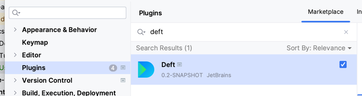
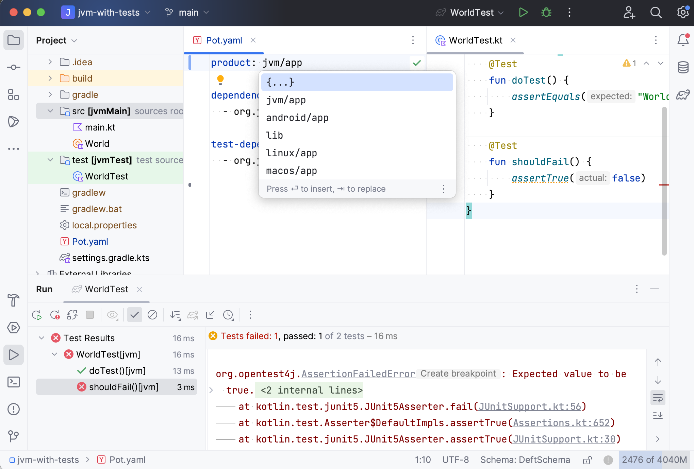
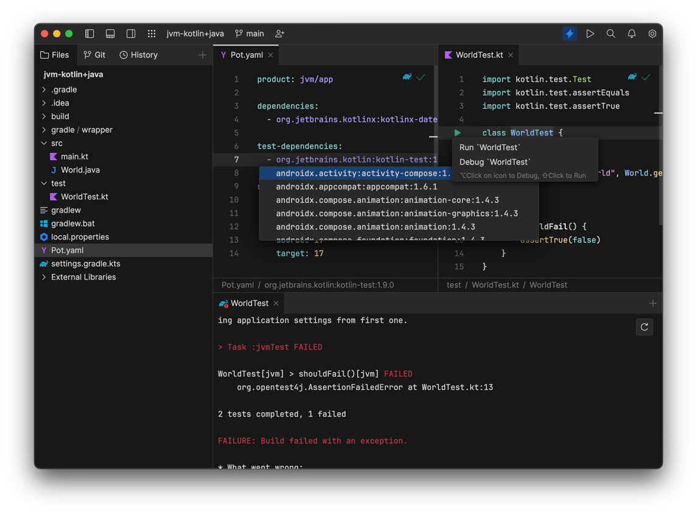

## Check your IDE
 
The recommended IDE for Kotlin Multiplatform is [Fleet](https://www.jetbrains.com/fleet/) version 1.25.+. For JVM projects use [IntelliJ IDEA 2023.3 EAP](https://www.jetbrains.com/idea/nextversion/).
The best way to get the most resent IDE versions is by using the [Toolbox App](https://www.jetbrains.com/lp/toolbox/).

If you use IntelliJ IDEA, install the Amper plugin: 

Fleet + KMP comes with Amper plugin.

## Prepare the environment
- Install and configure the latest JDK 17+. 
- Install and configure the latest Android Studio for Android samples.
- Install and configure the latest Xcode for iOS samples.

Use the [KDoctor](https://github.com/Kotlin/kdoctor) tool to ensure that your development environment is configured correctly:

1. Install KDoctor with [Homebrew](https://brew.sh/):

    ```text
    brew install kdoctor
    ```

2. Run KDoctor in your terminal:

    ```text
    kdoctor
    ```

   If everything is set up correctly, you'll see valid output:

   ```text
   Environment diagnose (to see all details, use -v option):
   [✓] Operation System
   [✓] Java
   [✓] Android Studio
   [✓] Xcode
   [✓] Cocoapods
   
   Conclusion:
     ✓ Your system is ready for Kotlin Multiplatform Mobile development!
   ```

Otherwise, KDoctor will highlight which parts of your setup still need to be configured and will suggest a way to fix
them.


- Try opening [an example project](../examples/jvm-kotlin+java). 
  You should get completion in the module.yaml files:
  
  

### What's next
See the [tutorial](Tutorial.md) and [documentation](Documentation.md). Try opening the examples projects:
  - [JVM Hello World](../examples/jvm-kotlin+java)
  - [Compose Desktop](../examples/compose-desktop)
  - [Kotlin Multiplatform](../examples/multiplatform)

Read how to use Amper in [IntelliJ IDEA](../README.md#using-amper-in-intellij-idea) and [Fleet](../README.md#using-amper-in-fleet).