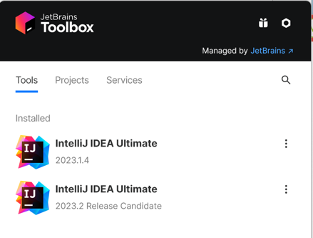
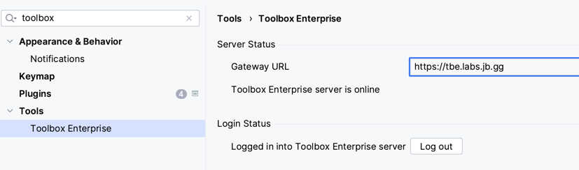
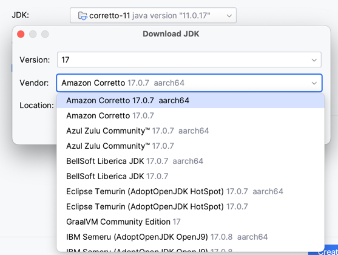
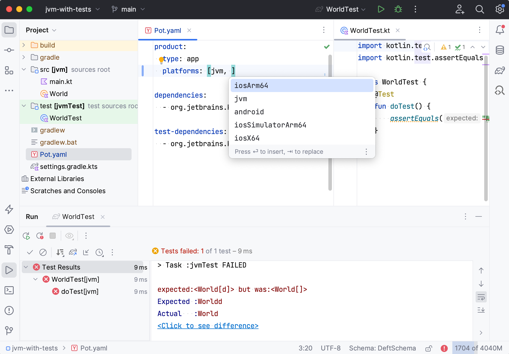

- Make sure you have the [latest released](https://www.jetbrains.com/idea/download/) or [EAP version](https://www.jetbrains.com/idea/nextversion/) of IntelliJ IDEA.

- Install [Toolbox App](https://www.jetbrains.com/lp/toolbox/)

- [Connect IntelliJ IDEA with Toolbox Enterprise](https://tbe.labs.jb.gg/) for the Deft plugin

  
  .

- Install Deft plugin for IntelliJ IDEA.
 
  

  For the nightly plugin updates add https://tbe.labs.jb.gg/api/plugin-repository?pluginId=org.jetbrains.deft&channel=Nightly to the list in `IntelliJ IDEA | Settings | Plugins | Manage plugin repositories...`
  

- Install JDK 17 (you can use IntelliJ IDEA [new project wizard](https://www.jetbrains.com/help/idea/new-project-wizard.html#new-project-no-frameworks) to install a compatible JDK version)

  
 

- Try opening examples projects:
  - [JVM Hello World](../examples/jvm-kotlin+java)
  - [Compose Desktop](../examples/compose-desktop)
  - [Kotlin Multiplatform](../examples/multiplatform)

- See the [tutorial](Tutorial.md) and [documentation](Documentation.md) for the next steps.

  
 

