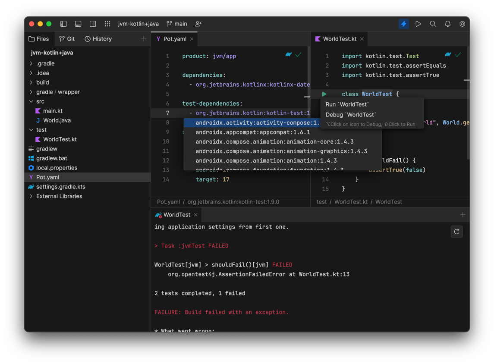

- Install the latest Fleet with KMP tooling preview (1.24.86+) using the [Toolbox App](https://www.jetbrains.com/lp/toolbox/). 

- Try opening [an example project](../examples/jvm-kotlin+java). 
  You should get completion in the Pot.yaml files:
  

 

