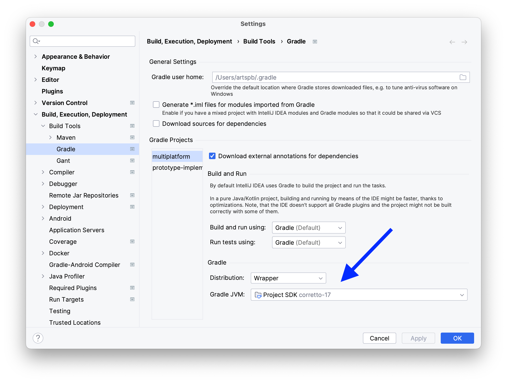
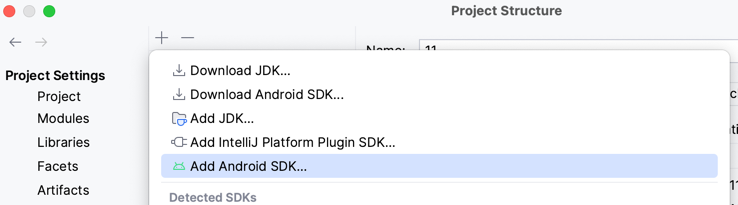

- Make sure you have the latest EAP/nightly IntelliJ IDEA 2023.3 build.

- Install [Toolbox App](https://www.jetbrains.com/lp/toolbox/)

- [Connect IntelliJ IDEA with Toolbox Enterprise](https://tbe.labs.jb.gg/) for the Deft plugin.

  
  

- Install Deft plugin for IntelliJ IDEA.
 
  

- Install JDK 17 (you can use IntelliJ IDEA [new project wizard](https://www.jetbrains.com/help/idea/new-project-wizard.html#new-project-no-frameworks) to install a compatible JDK version)

  

- After specifying a project JDK, check that Gradle has it properly configured as well.

  

- Android projects require their own SDK. To install it:
  - either install and configure Android Studio
  - or install Android SDK manually using [these instructions](https://stackoverflow.com/questions/45268254/how-do-i-install-the-standalone-android-sdk-and-then-add-it-to-intellij-idea-on/45268592#45268592).
    Enable Android plugin in IntelliJ IDEA, add Android SDK in the Project Structure dialog, and mention it in `<project_root>/local.properties` via `sdk.path=<path_to_sdk>`.

  

- Try opening [an example project](../examples/jvm-kotlin+java). 
  You should get completion in the Pot.yaml files:
  
 

