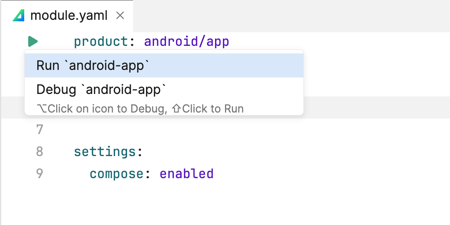
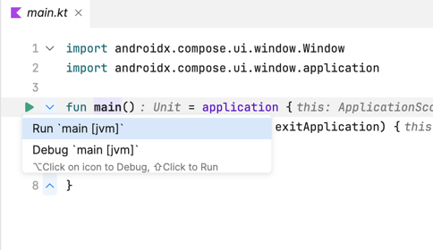
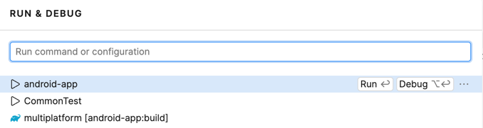
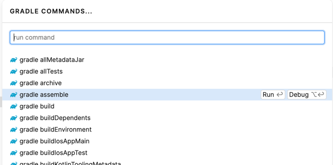
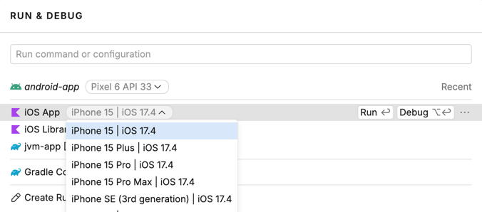
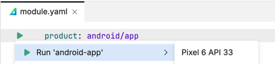

### Using the Gradle-based Amper version from the command line

In a [Gradle-based project](Documentation.md#gradle-based-projects), you can use Gradle as usual.
For example, to build and run the [JVM "Hello, World"](../examples-gradle/jvm) example:
```
cd jvm
./gradlew run 
```
See the [Gradle tutorial](https://docs.gradle.org/current/samples/sample_building_java_applications.html) for more info.

> To use Amper with Kotlin Multiplatform (e.g. running on devices and simulators), [Fleet](#using-amper-in-fleet) is
> recommended.

### Using the standalone Amper version from the command line

To use the Amper CLI, you need to download the wrapper script to your project's root folder. The wrapper script is
a small file that downloads and runs the actual Amper CLI distribution.

Depending on your operating system, use one of the following commands to download the wrapper script:
Linux/macOS:
```
curl -fsSL -o amper "https://packages.jetbrains.team/maven/p/amper/amper/org/jetbrains/amper/cli/0.4.0-dev-613/cli-0.4.0-dev-613-wrapper?download=true" && chmod +x amper
```

Windows powershell:
```
Invoke-WebRequest -Uri https://packages.jetbrains.team/maven/p/amper/amper/org/jetbrains/amper/cli/0.4.0-dev-613/cli-0.4.0-dev-613-wrapper.bat?download=true -OutFile amper.bat
```

Alternatively, you can use any other method to download the wrapper script from the Maven repository, as long as you
save it with the correct name and extension.

After that, run the Amper script to explore what is possible using Amper CLI:

Linux/macOS
```
./amper --help
```

Windows powershell:

```
./amper.bat --help
```

> The first time you run the wrapper script, it will take some time to download the JDK and Amper CLI distribution.
Subsequent runs will be faster, as the downloaded files will be cached locally.

Useful commands:
- `amper init` to create a new Amper project
- `amper build` to compile and link all code in the project
- `amper test` to run tests in the project
- `amper run` to run your application 
- `amper clean` to remove the project's build output and caches

E.g. to build and run the [JVM "Hello, World"](../examples-standalone/jvm):
```
cd jvm
./amper run 
```


### Using Amper in IntelliJ IDEA

See [the setup instructions](Setup.md) to configure your IDE and the environment.

Open an Amper project as usual by [pointing at the root folder](https://www.jetbrains.com/guide/java/tutorials/import-project/open-project/).

To run an application:

* use a 'run' () gutter icon next to the `product: ` section in a module.yaml file:\
 


* use a 'run' () gutter icon next to the `main()` function:\
  


* use [Run/Debug configurations](https://www.jetbrains.com/help/idea/run-debug-configuration.html):\
  \
  


* (Gradle-based projects only) launch a Gradle task directly:\
  
  

To run tests use the same 'run' () gutter icon or Gradle run configuration. Read more on [testing in IntelliJ IDEA](https://www.jetbrains.com/help/idea/work-with-tests-in-gradle.html#run_gradle_test).\


### Using Amper in Fleet
See [the setup instructions](Setup.md) to configure your IDE and the environment.

Open an Amper project as usual by [pointing at the root folder](https://www.jetbrains.com/help/fleet/workspace.html#-s4tcw2_13).

To run an application:

* use a 'run' () gutter icon next to the `product: ` section in a module.yaml file:\
 


* use a 'run' () gutter icon next to the `main()` function:\
  


* use [Run configurations](https://www.jetbrains.com/help/fleet/getting-started-with-kotlin-in-fleet.html#create-rc):\
  


* (Gradle-based projects only) launch a Gradle task directly:\
  

To run tests, use the same 'run' () gutter icon or Gradle run configuration.

#### Configuring device and simulators
To [select a target device](https://www.jetbrains.com/help/fleet/kotlin-multiplatform.html#run) used to run an Android or iOS application:

* use the device switcher in the Fleet run configuration:\
 
 
* use the device switcher in the 'run' () gutter icon:\
 


