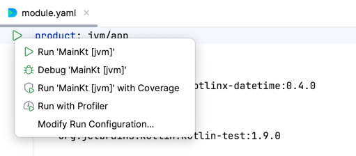
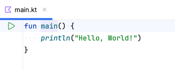
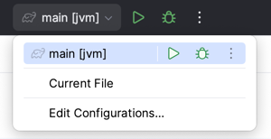
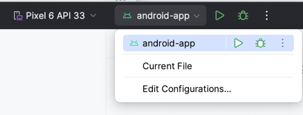
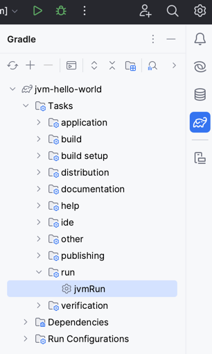
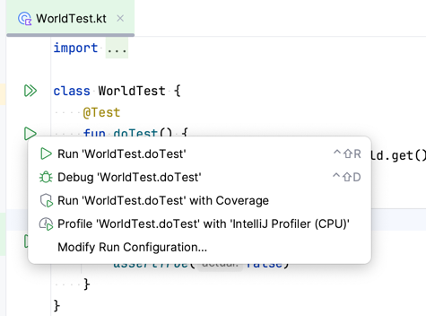

### Using Amper from the command line

> Amper has a self-containing executable that can be downloaded using the standard OS tools.

To use the Amper CLI, you need to download the Amper executable script to your project's root folder. The script is
a small file that downloads and runs the actual Amper CLI distribution.

Depending on your operating system, use one of the following commands to download the script:
Linux/macOS:
```
curl -fsSL -o amper "https://packages.jetbrains.team/maven/p/amper/amper/org/jetbrains/amper/cli/0.7.0-dev-2689/cli-0.7.0-dev-2689-wrapper?download=true" && chmod +x amper
```

Windows powershell:
```
Invoke-WebRequest -Uri https://packages.jetbrains.team/maven/p/amper/amper/org/jetbrains/amper/cli/0.7.0-dev-2689/cli-0.7.0-dev-2689-wrapper.bat?download=true -OutFile amper.bat
```

Alternatively, you can use any other method to download the script from the Maven repository, as long as you
save it with the correct name and extension.

After that, run the Amper script to explore what is possible using Amper CLI:

```
./amper --help
```

> The first time you run the Amper script, it will take some time to download the JDK and Amper CLI distribution.
> Subsequent runs will be faster, as the downloaded files will be cached locally.

Useful commands:
- `amper init` to create a new Amper project
- `amper build` to compile and link all code in the project
- `amper test` to run tests in the project
- `amper run` to run your application 
- `amper clean` to remove the project's build output and caches

E.g. to build and run the [JVM "Hello, World"](../examples-standalone/jvm):
```
cd jvm
./amper run 
```

#### Amper CLI tab-completion

If you’re using `bash`, `zsh`, or `fish`, you can generate a completion script to source as part of your shell’s
configuration, to get tab completion for Amper commands.

First, generate the completion script using the `generate-completion` command, specifying the shell you use:

```
./amper generate-completion zsh > ~/amper-completion.sh
```

Then load the script in your shell (this can be added to `.bashrc`, `.zshrc`, or similar configuration files to load it
automatically):

```
source ~/amper-completion.sh
```

You should now have tab completion available for Amper subcommands, options, and option values.

#### Updating Amper to a newer version

Run `./amper update` to update the Amper scripts and distribution to the latest released version.
Use the `--dev` option if you want to try the bleeding edge dev build of Amper (no guarantees are made on these builds).

See `./amper update -h` for more information about the available options.

> Note: if you had generated a completion script before, you need to re-generate it with the new Amper version (see
> previous section).

### Using the Gradle-based Amper version from the command line

> To use the Gradle-based version of Amper: 
> * JDK 17+ is required. 
> * Gradle 8.7+ is required. 
  To make sure your project uses the desired Gradle version, 
  check the `./gradle/wrapper/gradle-wrapper.properties` in the root of your project.

To learn how to add Amper to your existing Gradle project, 
check the [documentation](Documentation.md#gradle-based-projects) and the [tutorial](GradleMigration.md).
After adding Amper, you can use Gradle as usual.

For example, to build and run the [JVM "Hello, World"](../examples-gradle/jvm) example:
```
cd jvm
./gradlew run 
```
See the [Gradle tutorial](https://docs.gradle.org/current/samples/sample_building_java_applications.html) for more info.

> To use Amper with Kotlin Multiplatform (e.g. running on devices and simulators), [Fleet](#using-amper-in-fleet) is
> recommended.

#### Updating Gradle-based Amper to a newer version

To find the latest Amper version, check the [releases section](https://github.com/JetBrains/amper/releases) in GitHub.

Then, update the Amper plugin version in your `settings.gradle.kts` file: 

```kotlin
// ...
pluginManagement {
    repositories {
        // check Amper repositories:
        google()
        maven("https://packages.jetbrains.team/maven/p/amper/amper")
        maven("https://www.jetbrains.com/intellij-repository/releases")
        maven("https://packages.jetbrains.team/maven/p/ij/intellij-dependencies")
    }
}
// ...
plugins {
    // update the Amper plugin version here:
    id("org.jetbrains.amper.settings.plugin").version("0.7.0-dev-2689")
}
// ...
```

### Using Amper in IntelliJ IDEA

> The latest [IntelliJ IDEA EAP](https://www.jetbrains.com/idea/nextversion/) can be used to work with 
> JVM and Android projects.

See [the setup instructions](Setup.md) to configure your IDE and the environment.

Open an Amper project as usual by [pointing at the root folder](https://www.jetbrains.com/guide/java/tutorials/import-project/open-project/).

To run an application:

* use a 'run' () gutter icon next to the `product: ` section in a module.yaml file:\
 


* use a 'run' () gutter icon next to the `main()` function:\
  


* use [Run/Debug configurations](https://www.jetbrains.com/help/idea/run-debug-configuration.html):\
  \
  


* (Gradle-based projects only) launch a Gradle task directly:\
  
  

To run tests use the same 'run' () gutter icon or Gradle run configuration. Read more on [testing in IntelliJ IDEA](https://www.jetbrains.com/help/idea/work-with-tests-in-gradle.html#run_gradle_test).\

