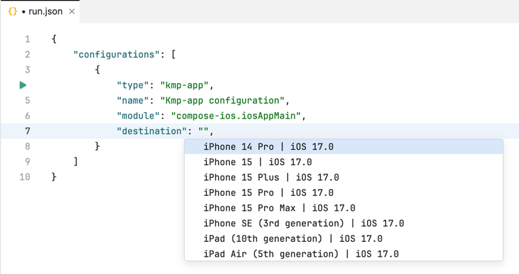

### Using Amper from command line

Since Amper is currently [Gradle-based](Documentation.md#gradle-based-projects) you can use it as usually:
E.g. to build and run the [JVM Hello, World](../examples/jvm-hello-world):
```
cd jvm-hello-world
./gradlew run 
```
See the [Gradle tutorial](https://docs.gradle.org/current/samples/sample_building_java_applications.html) for more info.

_Note, that to use Amper with Kotlin Multiplatform (e.g. running on devices and simulators), [Fleet](#using-amper-in-fleet) is recommended._

### Using Amper in IntelliJ IDEA and Android Studio

See [the setup instructions](Setup.md) to configure your IDE and the environment.

Open an Amper project as usual by pointing at the folder with the main `settings.gradle.kts` file:

To run an application:

* use a 'run' () gutter icon next to the `product: ` section in a module.yaml file:\
 


* use a 'run' () gutter icon next to the `main()` function:\
  


* use [Run/Debug configurations](https://www.jetbrains.com/help/idea/run-debug-configuration.html):\
  \
  


* launch a Gradle task directly:\
  
  

To run tests use the same 'run' () gutter icon or Gradle run configuration. Read more on [testing in IntelliJ IDEA](https://www.jetbrains.com/help/idea/work-with-tests-in-gradle.html#run_gradle_test).\


### Using Amper in Fleet
See [the setup instructions](Setup.md) to configure your IDE and the environment.

Open an Amper project as usual by pointing at the folder with the main settings.gradle.kts file:

To run an application:

* use a 'run' () gutter icon next to the `product: ` section in a module.yaml file:\
 


* use a 'run' () gutter icon next to the `main()` function:\
  


* use [Run configurations](https://www.jetbrains.com/help/fleet/getting-started-with-kotlin-in-fleet.html#create-rc):\
  \
  


* launch a Gradle task directly:\
  

To run tests use the same 'run' () gutter icon or Gradle run configuration.

#### Configuring device and simulators
To select a target device used to an Android or iOS application:

* Create a run configuration in `.fleet/run.json`:\  
  

* Specify a type - `kmp-app` for iOS or `android-app` for Android - and a device or a simulator in the `destination` parameter:\   
  \
  


