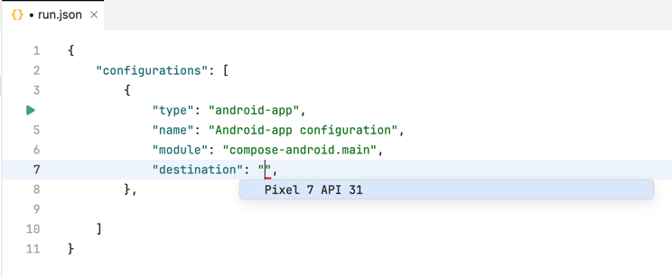

### Using the Gradle-based Amper from command line

You can use the [Gradle-based](Documentation.md#gradle-based-projects) Amper is you normally use Gradle. 
E.g. to build and run the [JVM Hello, World](../examples/jvm-hello-world):
```
cd jvm-hello-world
./gradlew run 
```
See the [Gradle tutorial](https://docs.gradle.org/current/samples/sample_building_java_applications.html) for more info.

> To use Amper with Kotlin Multiplatform (e.g. running on devices and simulators), [Fleet](#using-amper-in-fleet) is
> recommended.

### Using the standalone Amper from command line

To use Amper CLI, you need to download the wrapper script to your project's root folder. The wrapper script is
a small file that downloads and runs the actual Amper CLI distribution.

Depending on your operating system, use one of the following commands to download the wrapper script:
Linux/macOS:
```
curl -fsSL -o amper.sh "https://packages.jetbrains.team/maven/p/amper/amper/org/jetbrains/amper/cli/0.3.0-dev-534/cli-0.3.0-dev-534-wrapper.sh?download=true" && chmod +x amper.sh
```

Windows powershell:
```
Invoke-WebRequest -Uri https://packages.jetbrains.team/maven/p/amper/amper/org/jetbrains/amper/cli/0.3.0-dev-534/cli-0.3.0-dev-534-wrapper.bat?download=true -OutFile amper.bat
```

Alternatively, you can use any other method to download the wrapper script from the Maven repository, as long as you
save it with the correct name and extension.

After that, run the Amper script to explore what is possible using Amper CLI:

Linux/macOS
```
./amper.sh --help
```

Windows powershell:

```
./amper.bat --help
```

> The first time you run the wrapper script, it will take some time to download the JDK and Amper CLI distribution.
Subsequent runs will be faster, as the downloaded files will be cached locally.

### Using Amper in IntelliJ IDEA

See [the setup instructions](Setup.md) to configure your IDE and the environment.

Open an Amper project as usual by pointing at the folder with the main `settings.gradle.kts` file:

To run an application:

* use a 'run' () gutter icon next to the `product: ` section in a module.yaml file:\
 


* use a 'run' () gutter icon next to the `main()` function:\
  


* use [Run/Debug configurations](https://www.jetbrains.com/help/idea/run-debug-configuration.html):\
  \
  


* launch a Gradle task directly:\
  
  

To run tests use the same 'run' () gutter icon or Gradle run configuration. Read more on [testing in IntelliJ IDEA](https://www.jetbrains.com/help/idea/work-with-tests-in-gradle.html#run_gradle_test).\


### Using Amper in Fleet
See [the setup instructions](Setup.md) to configure your IDE and the environment.

Open an Amper project as usual by pointing at the folder with the main settings.gradle.kts file:

To run an application:

* use a 'run' () gutter icon next to the `product: ` section in a module.yaml file:\
 


* use a 'run' () gutter icon next to the `main()` function:\
  


* use [Run configurations](https://www.jetbrains.com/help/fleet/getting-started-with-kotlin-in-fleet.html#create-rc):\
  \
  


* launch a Gradle task directly:\
  

To run tests use the same 'run' () gutter icon or Gradle run configuration.

#### Configuring device and simulators
To select a target device used to an Android or iOS application:

* Create a run configuration in `.fleet/run.json`:\  
  

* Specify a type - `kmp-app` for iOS or `android-app` for Android - and a device or a simulator in the `destination` parameter:\   
  \
  


