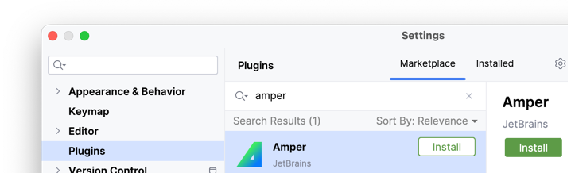

# IDE Setup

??? question "Do I need to use IntelliJ IDEA?"

    Amper is a command line tool that stands on its own, so using IntelliJ IDEA is not required.
    If you prefer to work directly with the terminal or in another IDE, head over to the [Amper CLI](cli.md) section.

    However, to make the most out of Amper and its toolability, we recommend using IntelliJ IDEA.
    There are tons of diagnostics and quick fixes that make your life a bliss when working with Amper.

1. Preferably use the latest [:intellij-idea: IntelliJ IDEA EAP](https://www.jetbrains.com/idea/nextversion/). 
   The best way to get the most recent IDE versions is by using the [:toolbox-app: Toolbox App](https://www.jetbrains.com/lp/toolbox/).

2. Make sure to install the [:amper: Amper plugin](https://plugins.jetbrains.com/plugin/23076-amper):

   

3. [Optional] If you want to write code for :material-apple: Apple platforms or share code between several platforms, 
   install the [Kotlin Multiplatform plugin](https://plugins.jetbrains.com/plugin/14936-kotlin-multiplatform).

4. [Optional] If you want to write some Android-specific code, also install the
   [:android-head-flat: Android plugin](https://plugins.jetbrains.com/plugin/22989-android).
