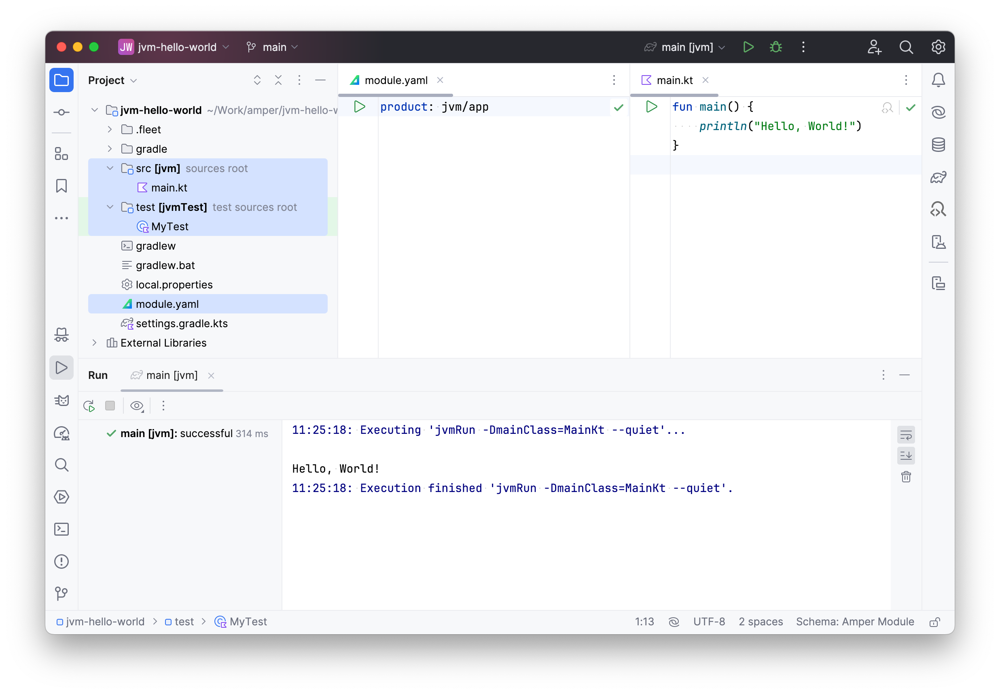

---
hide:
  - navigation
---

# Amper

Amper is an experimental build tool for the Kotlin and Java languages, with a focus on user experience and tooling.

It can build plain JVM console applications, Android and iOS mobile applications, server-side application like Spring
or Ktor, multiplatform projects that share business logic and/or UI, and more.

[Get started](getting-started/index.md){ .md-button .md-button--primary }
[:material-book-open-page-variant: Learn](user-guide/index.md){ .md-button }

## Philosophy

Amper should be invisible when you're working on your code – nobody likes dealing with the build tool.
Ideally, you shouldn't have to leave your source files to adjust the build configuration.

When you do edit the build configuration by hand, we want the experience to be as smooth and enjoyable as possible.

We believe that this can be achieved by:

- providing a declarative configuration DSL – to simplify not only the initial setup but also improve maintainability 
  and let IDEs assist with automatic configuration reliably;
- bundling a curated set of toolchains – to support the majority of the scenarios without the need to find compatible
  plugins;
- carefully choosing the extensibility points – to keep the overall mental model and UX of the configuration consistent
  and to avoid unexpected third-party code execution.

In essence, we aim to achieve a similar well-thought-out and well-tested experience as with [JetBrains IDEs](https://www.jetbrains.com/ides/).

## Project status [](https://github.com/JetBrains#jetbrains-on-github)

Amper is still in the experimental phase, but we encourage you to try it out and 
[give us feedback](#issues-and-feedback).

We’re currently looking at various aspects, including extensibility, publication, and Maven integration.

## Supported features

* [x] Creating and running JVM, Android, iOS, Linux, Windows, and macOS applications
* [x] Creating Kotlin Multiplatform libraries
* [x] Running tests
* [x] Mixing Kotlin, Java, and Swift code
* [x] Code assistance for [module files](user-guide/basics.md#module-file-anatomy) in IntelliJ IDEA
* [x] [Multi-module](user-guide/basics.md#project-layout) projects
* [x] [Compose Multiplatform](user-guide/builtin-tech/compose-multiplatform.md), with
  [multiplatform resources](user-guide/builtin-tech/compose-multiplatform.md#using-multiplatform-resources) and
  [Compose Hot Reload](user-guide/builtin-tech/compose-multiplatform.md#compose-hot-reload-experimental)
* [x] Integration with [Gradle version catalogs](user-guide/dependencies.md#library-catalogs-aka-version-catalogs)
* [x] Extensibility (Preview)

Future directions:

* [ ] Packaging, publication, distribution
* [ ] Maven migration
* [ ] More features for extensibility
* [ ] Platform-specific test types, including android instrumented tests.
* [ ] Native dependencies support, such as CocoaPods, Swift Package Manager
* [ ] Build variants support

## Issues and feedback

Amper uses [:jetbrains-youtrack: YouTrack](https://youtrack.jetbrains.com/issues/AMPER) for issue tracking,
[create a new issue](https://youtrack.jetbrains.com/newIssue?project=AMPER) there to report problems or submit ideas.

You can also join the [:material-slack: Slack channel](https://kotlinlang.slack.com/archives/C062WG3A7T8) for discussions.

## Examples

### Basics

Here is a very basic JVM "Hello, World!" project:


The `main.kt` and `MyTest.kt` files are just regular Kotlin files with nothing special in them.
The interesting part is `module.yaml`, which is the Amper module configuration file.
For the above project structure, it would simply be:

```yaml
# Produce a JVM application 
product: jvm/app
```

That's it. The Kotlin and Java toolchains, test framework, and other necessary functionality are configured and available straight out of the box.
You can build it, run it, write and run tests, and more.
For more detailed information, check out the [full example]({{ examples_base_url }}/jvm).



### Multiplatform

Now, let's look at a Compose Multiplatform project with Android, iOS, and desktop JVM apps, with the following project structure in Fleet:


Notice how the `src/` folder contains Kotlin and Swift code together. It could, of course, also be Kotlin and Java.
Another aspect to highlight is the shared module with the common code in the `src` folder and the platform-specific code
folders `src@ios` and `src@android` (learn more about [project layout](user-guide/basics.md#project-layout)).

Here is how `ios-app/module.yaml` file looks:
```yaml
# Produce an iOS application
product: ios/app

# Depend on the shared library module: 
dependencies:
  - ../shared

settings:
  # Enable the Compose Multiplatform framework
  compose: enabled
```

This is pretty straightforward: it defines an iOS application with a dependency on a shared module and enables the Compose Multiplatform framework.
A more interesting example would be `shared/module.yaml`:

```yaml
# Produce a shared library for the JVM, Android, and iOS platforms:
product:
  type: lib
  platforms: [jvm, android, iosArm64, iosSimulatorArm64, iosX64]

# Shared Compose dependencies:
dependencies:
  - $compose.foundation: exported
  - $compose.material3: exported

# Android-only dependencies  
dependencies@android:
  # Android-specific integration with Compose
  - androidx.activity:activity-compose:1.7.2: exported
  - androidx.appcompat:appcompat:1.6.1: exported

settings:
  # Enable Kotlin serialization
  kotlin:
    serialization: json
  
  # Enable the Compose Multiplatform framework
  compose: enabled
```

A couple of things are worth mentioning.
Note the platform-specific `dependencies@android` section with the `@<platform>` qualifier.
[The platform qualifier](user-guide/multiplatform.md#platform-qualifier) can be used both in the manifest and also in 
the file layout. The qualifier organizes the code, dependencies, and settings for a certain platform.


Naturally, these examples show only a limited set of Amper features.
To get more insight into design and functionality, look at the [user guide](user-guide/index.md),
the [tutorial](getting-started/tutorial.md), and [example projects](#more-examples).

### More examples

Check our these example projects:

* [JVM "Hello, World!"]({{ config.repo_url }}/tree/{{git.short_tag or "HEAD"}}/examples/jvm)
* [Compose Multiplatform]({{ examples_base_url }}/compose-multiplatform)
* Compose on [iOS]({{ examples_base_url }}/compose-ios), [Android]({{ examples_base_url }}/compose-android),
  and [desktop]({{ examples_base_url }}/compose-desktop)
* Kotlin Multiplatform app template with [shared Compose UI](https://github.com/Kotlin/KMP-App-Template/tree/amper)
  and with [native Android and iOS UI](https://github.com/Kotlin/KMP-App-Template-Native/tree/amper)
* And other [examples]({{ examples_base_url }}/README.md)
