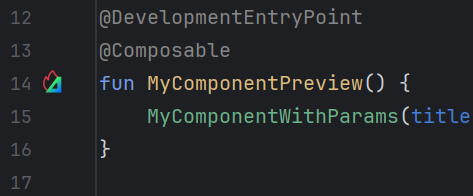

# :jetbrains-compose-multiplatform: Compose Multiplatform

[Compose Multiplatform](https://www.jetbrains.com/compose-multiplatform/) is a declarative UI framework developed by
JetBrains for sharing Kotlin UI code across multiple platforms.

## Enabling Compose

Use `settings.compose.enabled` to enable Compose:

=== ":intellij-java: JVM Desktop"

    ```yaml
    product: jvm/app
    
    dependencies:
      - $compose.desktop.currentOs # (1)!
        
    settings: 
      compose: enabled # (2)!
    ```

    1.    This library is from the built-in `$compose` catalog, accessible when Compose is enabled
    2.    Enables the Compose toolchain (compiler plugin and runtime dependencies)

=== ":android-head-flat: Android"

    ```yaml
    product: android/app
    
    dependencies:
      - $compose.foundation # (1)!
      - $compose.material3
    
    settings:
      compose: enabled # (2)!
    ```

    1.    These libraries are from the built-in `$compose` catalog, accessible when Compose is enabled
    2.    Enables the Compose toolchain (compiler plugin and runtime dependencies)

=== ":jetbrains-kotlin-multiplatform: Shared library"

    ```yaml
    product:
      type: lib
      platforms: [ jvm, android, iosSimulatorArm64, iosX64, iosArm64 ]
    
    dependencies:
      - $compose.foundation: exported # (1)!
      - $compose.material3: exported
    
    settings:
      compose:
        enabled: true # (2)!
    ```

    1.    These libraries are from the built-in `$compose` catalog, accessible when Compose is enabled. We export them
          to consumers because we use types from these libraries in our own public API.  
    2.    Enables the Compose toolchain (compiler plugin and runtime dependencies)

Enabling Compose does the following:

* configures the Compose compiler plugin for the Kotlin compiler
* adds the required `org.jetbrains.compose.runtime:runtime` dependency (implicitly)
* enables the built-in `$compose.*` library catalog for all optional Compose modules

### Custom Compose version

You can specify the exact version of the Compose framework to use this way:

```yaml
settings:
  compose:
    enabled: true
    version: 1.5.10
```

## Using multiplatform resources

Amper supports [Compose Multiplatform resources](https://www.jetbrains.com/help/kotlin-multiplatform-dev/compose-images-resources.html).

Place your resources in the `composeResources` folder at the root of your module:
```
my-kmp-module/
├─ src/
│  ╰─ ... # (1)!
├─ composeResources/
│  ├─ values/
│  │  ╰─ strings.xml
│  ╰─ drawable/
│     ╰─ image.jpg
╰─ module.yaml
```

1.   Your Kotlin code is here

Amper then automatically generates the Kotlin accessors for these resources, and you can use them in your Kotlin code:

```kotlin
import my_kmp_module.generated.resources.Res
import my_kmp_module.generated.resources.hello
// other imports

@Composable
private fun displayHelloText() {
    BasicText(stringResource(Res.string.hello))
}
```

Read more about setting up and using compose resources in
[the documentation](https://www.jetbrains.com/help/kotlin-multiplatform-dev/compose-images-resources.html).

### Generated accessors package

By default, resources accessors are generated in the package `<sanitized-module-name>.generated.resources`, where 
`<sanitized-module-name>` is the module name with all non-letter symbols replaced with `_`.

In the above example where the module name is `my-kmp-module`, the package name for the generated resources is 
therefore `my_kmp_module.generated.resources`.

You can customize the package name by setting the `settings.compose.resources.packageName` property in your module file:

```yaml
settings:
  compose:
    resources:
      packageName: com.example.gen
```

## :jetbrains-compose-hot-reload: Compose Hot Reload (experimental)

Amper supports [Compose Hot Reload](https://github.com/JetBrains/compose-hot-reload), allowing you to see UI changes in
real-time without restarting the application. This significantly improves the developer experience by shortening the
feedback loop during UI development.

### Hot-run your application

=== ":jetbrains-intellij-idea: IntelliJ IDEA"

    To run your application with Compose Hot Reload, simply select the *Run with Compose Hot Reload* option from the 
    IDE:

    
    
    ??? question "I don't have this option, please help!"

        Make sure that:

          * you have installed and enabled the [Amper IDEA plugin](https://plugins.jetbrains.com/plugin/23076-amper)
          * your module has the `jvm` target (`jvm/app` product type, or a library module with `jvm` platform)

    In this mode, IDEA will recompile and hot-reload your application based on file system changes.

=== ":octicons-terminal-16: CLI"

    To run your application with Compose Hot Reload from the [command line](../../cli/index.md), use the
    `--compose-hot-reload-mode` flag:
    
    ```shell
    ./amper run --compose-hot-reload-mode
    ```

    !!! warning "No file-system watch"

        At the moment, the Amper CLI doesn't watch the file system for changes, so the only way to reap the benefits
        of Compose Hot Reload is to run the application from the IDE.

When you run your application with Compose Hot Reload enabled:

- Amper automatically downloads and runs [JetBrains Runtime](https://github.com/JetBrains/JetBrainsRuntime) to maximize
  hot-swap capabilities
- The Java agent for Compose Hot Reload is attached during execution
- A small Compose Hot Reload devtools icon appears next to the application window, indicating that the feature is active

 

### Hot-run specific components

It's also possible to run specific composables in Compose Hot Reload mode instead of your entire application.
This is especially useful to check library components or just individual parts of your apps.

To do that, add the Compose Hot Reload runtime API dependency to your module:

```yaml
dependencies:
  - $compose.hotReload.runtimeApi # for @DevelopmentEntryPoint
```

And add the `@DevelopmentEntryPoint` annotation on any parameter-less `@Composable` function:

```kotlin
@DevelopmentEntryPoint // (1)!
@Composable
fun MySuperComponent() { // (2)!
    MyComponentWithParams(title = "Dummy title", description = "Lorem ipsum dolor sit amet")
}
```

1.   Makes the component runnable on its own
2.   The component must not have parameters

A clickable gutter icon will appear on the left side of the composable.


??? tip "Hot-reloading components with parameters"

    If your component needs parameters, you can create a wrapper component that just creates your component with 
    the parameter values you want to use for the hot run, and annotate the wrapper with `@DevelopmentEntryPoint`:

    ```kotlin
    @DevelopmentEntryPoint
    @Composable
    fun MyComponentPreview() {
        MyComponentWithParams(title = "Dummy title", description = "Lorem ipsum dolor sit amet")
    }
    
    @Composable
    fun MyComponentWithParams(title: String, description: String) {
        // Your composable code here
    }
    ```

### Custom Compose Hot Reload version

You can optionally customize the version of Compose Hot Reload used by Amper this way:

```yaml
settings:
  compose:
    enabled: true
    experimental:
      hotReload:
        version: 1.0.0-rc3
```
