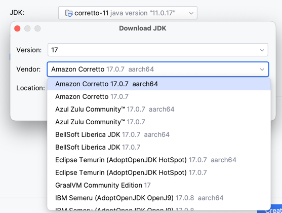
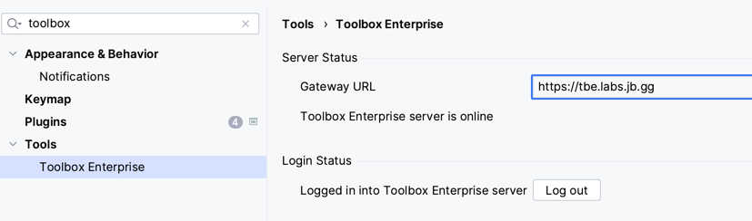
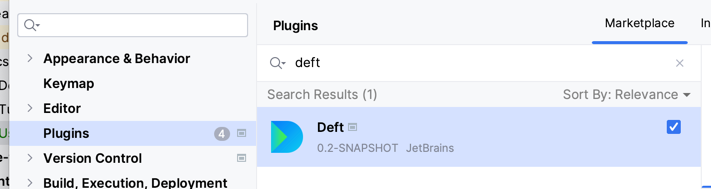
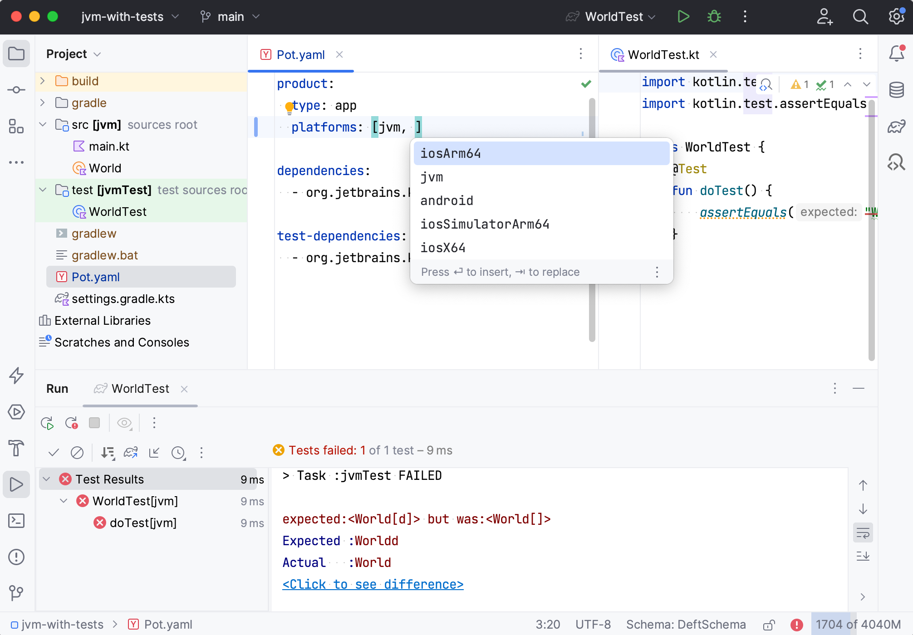

- Make sure you have the [latest released](https://www.jetbrains.com/idea/download/) or [EAP version](https://www.jetbrains.com/idea/nextversion/) of IntelliJ IDEA.
  

- Install JDK 17 (you can use IntelliJ IDEA [new project wizard](https://www.jetbrains.com/help/idea/new-project-wizard.html#new-project-no-frameworks) to install a compatible JDK version)
  
  

- Connect IntelliJ IDEA with Toolbox Enterprise (check https://tbe.labs.jb.gg/) for the Deft plugin
  .

- Install Deft plugin
  

- Open examples projects:
  - [JVM](../../examples/jvm-kotlin+java)
  - [Mobile Multiplatform](../../examples/kmp-mobile-modularized)

- See the [tutorial](Tutorial.md) and [documentation](Documentation.md) for the next steps.

